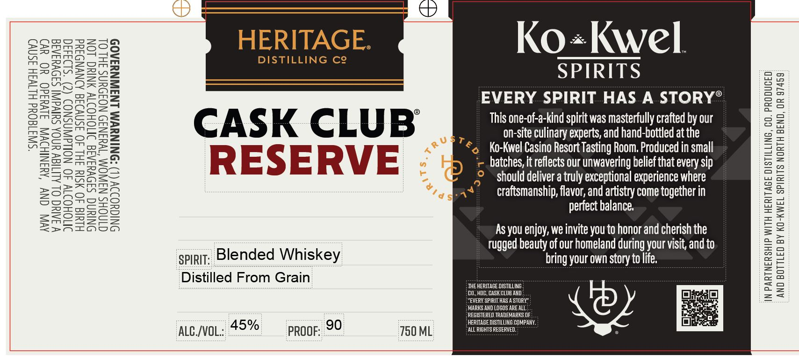

# TTB COLA Label Images - TTBID 26064001000492

**Brand Name:** HERITAGE DISTILLING CO. CASK CLUB RESERVE

**Issue Date:** 03/06/2026

**Origin Code:** 38

**Product Class/Type:** 137

**Source:** [TTB Public COLA Registry](https://ttbonline.gov/colasonline/viewColaDetails.do?action=publicFormDisplay&ttbid=26064001000492)

## Label Images

### Back Label

## Extracted Label Text

*Text extracted via OCR - may contain errors*

**Detected Proof:** 90

### Back Label

“SW3180Ud HLIVSH ASNV)

AVIN, ONY ‘AMSNIHOW J1Vuad0 YO ev)
VY IAYC OL ALIIGY UNOA SHIVA] SADVYIAIE
INOHOIW 40 NOLdWASNOD (2) °S1D3430
HIMId JO SIU FHL 4O ISNVIIG AINVNDAYd

SNIUNG SIOVYIAIG INOHOIW ANIUG LON
SNIGYODIV (L) SSNINUWM LNSWNUYIAO9

CINOHS NAWOM ‘WYINID NOFOYNS JH OL

Ko+Kwel

SPIRITS
EVERY. SPIRIT.HAS.A.STORY®.

Cc A S$ K C L U B This one-of-a-kind spirit was masterfully crafted by our
Me on-site culinary experts, and hand-bottled at the

“¢_ Ko-Kwel Casino Resort Tasting Room. Produced in small

PR E S [= RVE ‘c batches, it reflects our unwavering belief that every sip

© should deliver a truly exceptional experience where

HERITAGE.

DISTILLING Ce

.4* craftsmanship, flavor, and artistry come together in
perfect balance.

As you enjoy, we invite you to honor and cherish the
: tugged beauty of our homeland during your visit, and to.
spirit; Blended Whiskey bring your own story to life.

Distilled From Grain

MARKS AND LOGOS ARE:
REGISTERED TRADE
_HERCIAGE DISTILL

ALC./VOL.: 45% PROOF: 90 750 ML ‘ALL RIGHTS RESERV

IN PARTNERSHIP WITH HERITAGE DISTILLING, CO. PRODUCED
AND BOTTLED BY KO-KWEL SPIRITS NORTH BEND, OR 97459
