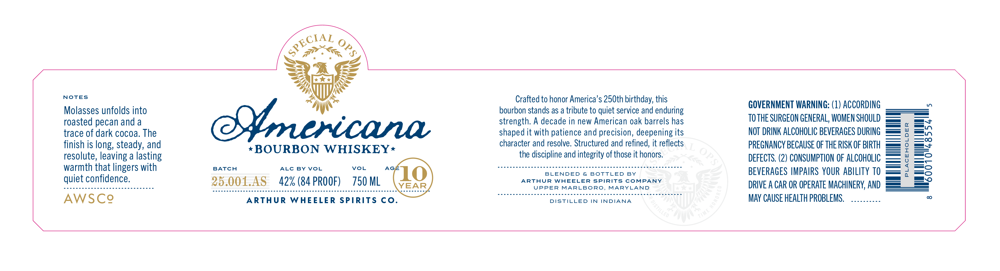

# TTB COLA Label Images - TTBID 26064001000550

**Brand Name:** ARTHUR WHEELER SPIRITS COMPANY

**Fanciful Name:** AMERICANA BOURBON WHISKEY

**Issue Date:** 03/06/2026

**Origin Code:** 25

**Product Class/Type:** 141

**Source:** [TTB Public COLA Registry](https://ttbonline.gov/colasonline/viewColaDetails.do?action=publicFormDisplay&ttbid=26064001000550)

## Label Images

### Label 1

## Extracted Label Text

*Text extracted via OCR - may contain errors*

### Label 1

NOTES

Molasses unfolds into
roasted pecan and a
trace of dark cocoa. The
finish is long, steady, and
resolute, leaving a lasting
warmth that lingers with
quiet confidence.

25.01.48 azx(eaprooe) rs0m (LO

ARTHUR WHEELER SPIRITS CO.

Crafted to honor America’s 250th birthday, this
bourbon stands as a tribute to quiet service and enduring
strength. A decade in new American oak barrels has
shaped it with patience and precision, deepening its
character and resolve. Structured and refined, it reflects

the discipline and integrity of those it honors.

BLENDED & BOTTLED BY
ARTHUR WHEELER SPIRITS COMPANY
UPPER MARLBORO, MARYLAND

DISTILLED IN INDIANA

GOVERNMENT WARNING: (1) ACCORDING
TOTHE SURGEON GENERAL, WOMEN SHOULD
NOT DRINK ALCOHOLIC BEVERAGES DURING
PREGNANCY BECAUSE OF THE RISK OF BIRTH
DEFECTS. (2) CONSUMPTION OF ALCOHOLIC
BEVERAGES IMPAIRS YOUR ABILITY 10
DRIVE A CAR OR OPERATE MACHINERY, AND
MAY CAUSE HEALTH PROBLEMS. ..........

ll
ill
qimts

PLACEHOLDER
