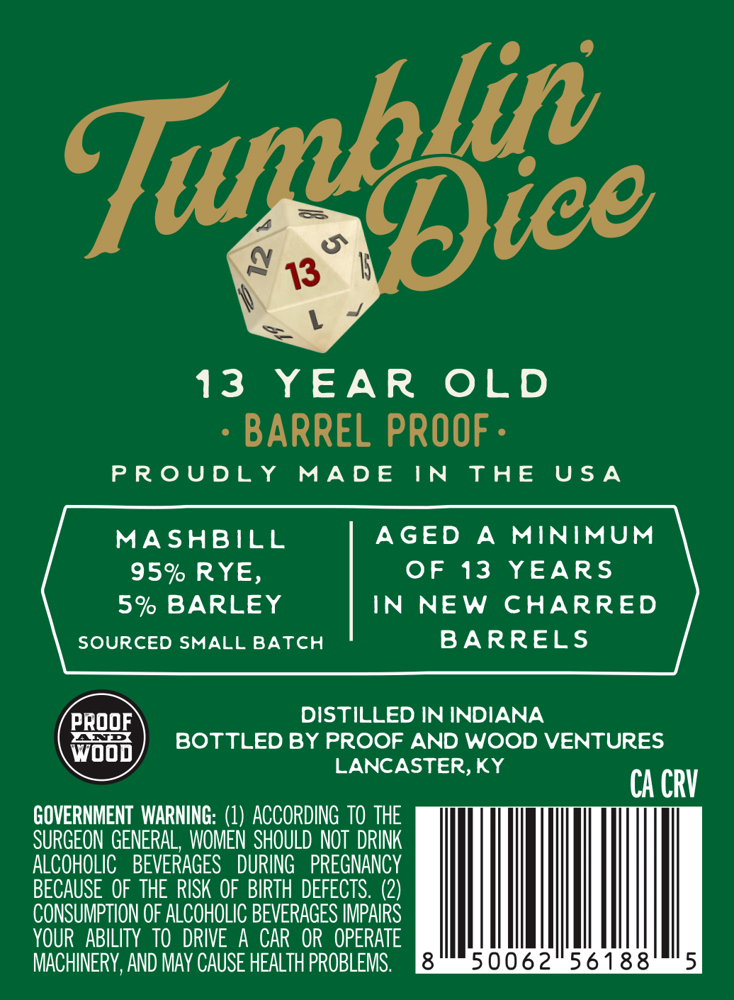
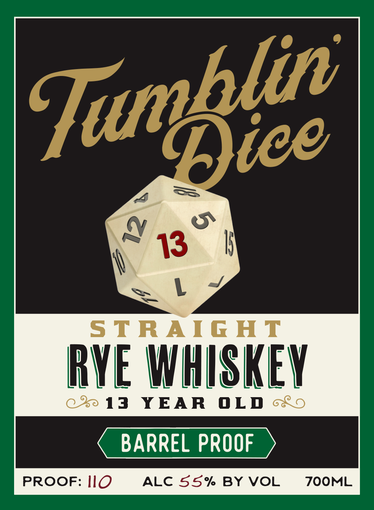

# TTB COLA Label Images - TTBID 26064001000560

**Brand Name:** TUMBLIN' DICE

**Issue Date:** 03/06/2026

**Origin Code:** 22

**Product Class/Type:** 102

**Source:** [TTB Public COLA Registry](https://ttbonline.gov/colasonline/viewColaDetails.do?action=publicFormDisplay&ttbid=26064001000560)

## Label Images

### Back Label

### Front Label

## Extracted Label Text

*Text extracted via OCR - may contain errors*

**Detected Age:** 13 Years

### Back Label

13 YEAR OLD
- BARREL PROOF -

PROUDLY MADE IN THE USA

MASHBILL AGED A MINIMUM
95% RYE, OF 13 YEARS
5% BARLEY IN NEW CHARRED
SOURCED SMALL BATCH BARRELS
PROOF DISTILLED IN INDIANA
wooo BOTTLED BY PROOF AND WOOD VENTURES
LANCASTER, KY CA cRV

GOVERNMENT WARNING: (1) ACCORDING TO THE
SURGEON GENERAL, WOMEN SHOULD NOT DRINK
ALCOHOLIC BEVERAGES DURING PREGNANCY
BECAUSE OF THE RISK OF BIRTH DEFECTS. (2)
CONSUMPTION OF ALCOHOLIC BEVERAGES IMPAIRS
YOUR ABILITY TO DRIVE A CAR OR OPERATE
MACHINERY, AND MAY CAUSE HEALTH PROBLEMS. Jaimie W0X¢Xo Sao) It: Sau)

### Front Label

6
13
1
STRAIG HT
RVE WHISKEY
13
YEAR
OLD
BARREL PROOF
PROOF: IlO
ALC 55% BY VOL
ZOOML
Tumblie |
