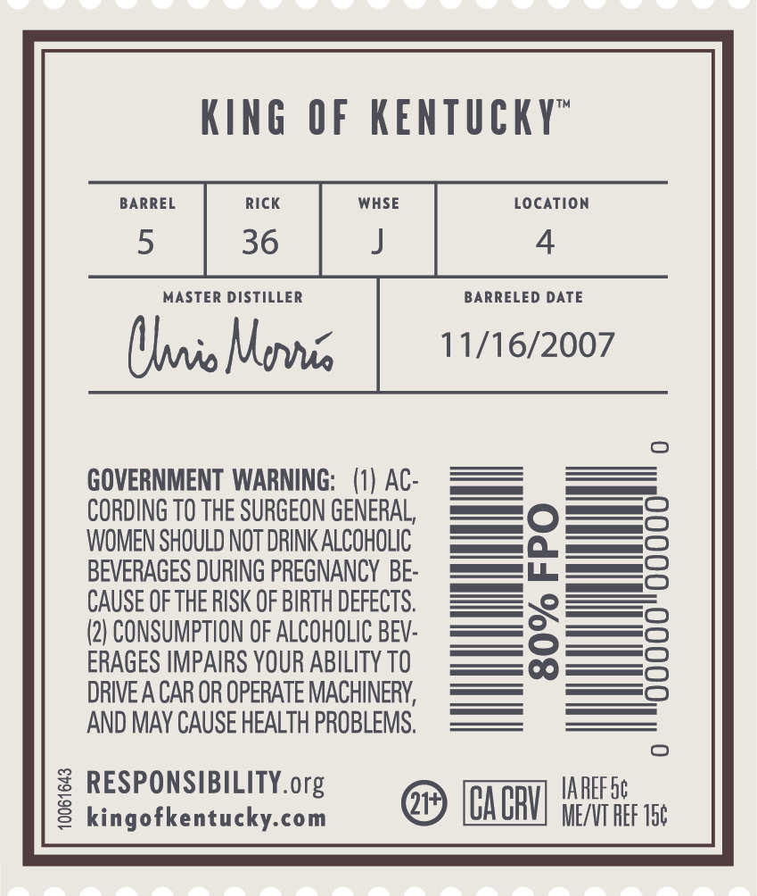
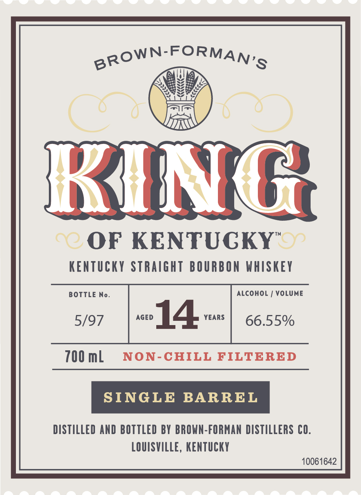
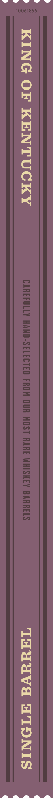

# TTB COLA Label Images - TTBID 26064001000691

**Brand Name:** KING OF KENTUCKY

**Fanciful Name:** SINGLE BARREL

**Issue Date:** 03/06/2026

**Origin Code:** 22

**Product Class/Type:** 101

**Source:** [TTB Public COLA Registry](https://ttbonline.gov/colasonline/viewColaDetails.do?action=publicFormDisplay&ttbid=26064001000691)

## Label Images

### Back Label

### Front Label

### Label 3

## Extracted Label Text

*Text extracted via OCR - may contain errors*

**Detected Proof:** 133.1
**Detected Age:** 14 Years

### Back Label

KInG
OF KENTUCKY"
BARREL
Rick
WHSE
LocaTiON
5
36
MASTER DISTILLER
BARRELED DATE
(lio Movis
11/16/2007
GOVERNMENT WARNING;   (1) AC:
CORDING TO THE SURGEON GENERAL;
WOMEN SHOULD NOT DRINK ALCOHOLIC
8
BEVERAGES DURING PREGNANCY BE:
CAUSE OF THE RISK OF BIRTH DEFECTS.
2
(2) CONSUMPTION OF ALCOHOLIC BEV:
ERAGES IMPAIRS YOUR ABILITY TO
DRIVE A CAR OR OPERATE MACHINERY,
AND MAY CAUSE HEALTH PROBLEMS.
3 RESPoNsnBuckY org
CACRU]
IAREF Sc
kingofkentucky-com
ME/VT REF 15c

### Front Label

BROWN-FORMAN'S
RING
Ad
OF KENTUGKY" o
KEnTUCKY Straight BOURBON WHISKEY
BOTTLE
No.
ALCOHOL
VOLUME
5/97
AGED
14
YEARS
66.55%
700 mL
NON-CHILL
FILTERED
SINGLE
BARREL
DISTILLED AND BOTTLEd BY BROWN-FORMAN DISTILLERS CO.
LOUISVILLE, KentucKY
10061642

### Label 3

wre VeuvwarlU( ew

10061856

KING OF KENTUCKY

CAREFULLY HAND-SELECTED FROM OUR MOST RARE WHISKEY BARRELS

THHaVd HIONIS
