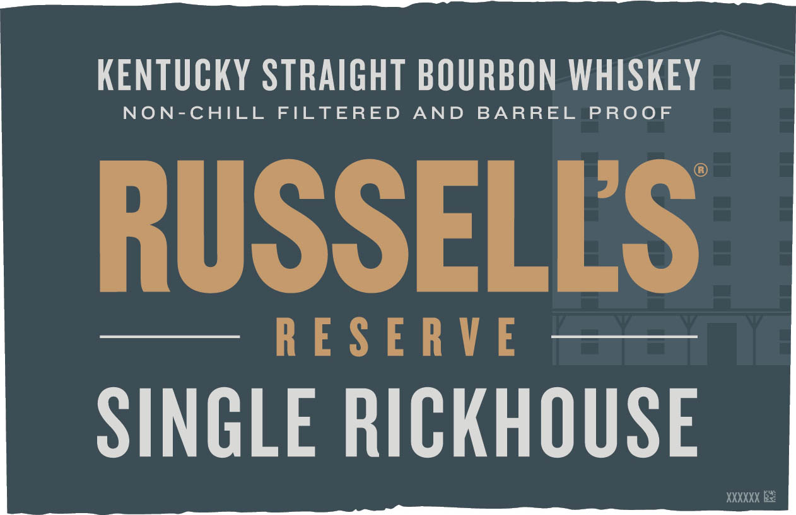
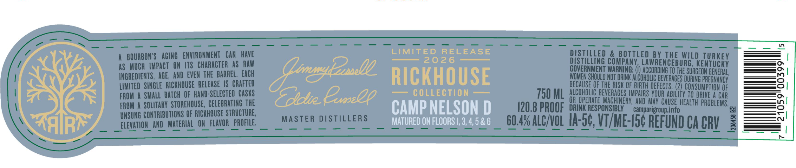
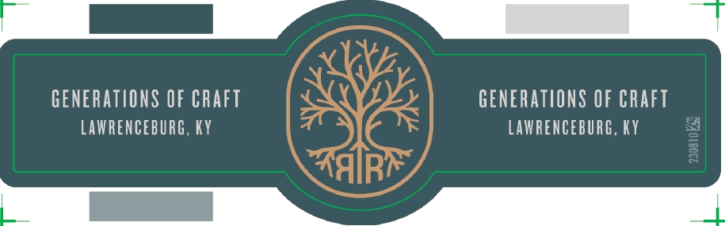

# TTB COLA Label Images - TTBID 26064001000707

**Brand Name:** RUSSELL'S RESERVE

**Fanciful Name:** SINGLE RICKHOUSE

**Issue Date:** 03/06/2026

**Origin Code:** 22

**Product Class/Type:** 101

**Source:** [TTB Public COLA Registry](https://ttbonline.gov/colasonline/viewColaDetails.do?action=publicFormDisplay&ttbid=26064001000707)

## Label Images

### Front Label

### Label 2

### Label 3

## Extracted Label Text

*Text extracted via OCR - may contain errors*

*1 image(s) excluded: text did not meet readability threshold*

### Front Label

KENTUCKY STRAIGHT BOURBON WHISKEY

NON-CHILL FILTERED AND BARRE PROOE

RUSSELLS

—— RESERVE |iGaieat

SINGLE RICKHOUSE

### Label 2

BOURBON'S   AGing   ENVIRONMENT   Can  HAVE
LIMITED
RELEASE
DISTILLED
2 BOTILED By IHE WILd IURKEY
as MUCH  IMPACT   ON ITS  ChARACTer AS Raw
2026
DISTWLHNG CoMpANY LAWRENCEBURG KENTUCKY
INGREDIENTS , AGE, AND  EVEN THE Barrel , Each
(mnylzsele
RICKHOUSE
SENNNOEE EGERERGMEHIGEEG
8
PREGNANCY
LIMITED   SINGLE   RICKHOUSE   ReleaSe |S  Crafted
BECAUSE QF The RISK OF BIRTH DEFECTS,
CONSUMPTION OF
FROM
SMAlL batch OF hand-SELECTED   CaSKS
Todtie Expz2q
COLLECTION
750 ML
ALCOHOLIC BEVERAGES IMPARSVOUR ABIlTTY To DRIVE A CAR
FROM A SOLITaRy  STOREHQUSE , CELEBRATINe THE
CAMP NELSON D
020.8 PROOF
ORIAPERESPONSTBLYEA campafgeoun IneoHEALTh PROblens'
8
UNSUNG CONTRIBUTIONS OF RIcKhOUSE STRUCTURE;
camparigroup info
@
Elevation AND   Material   ON_FLAVOr  PROFILE;
MAStER DISTILLERS
MATURED ON FLOORS |, 3,4,5 & 6
60 4% AlcngL IA-50, Vtme-I5e REfUNd Ca CRL 3
