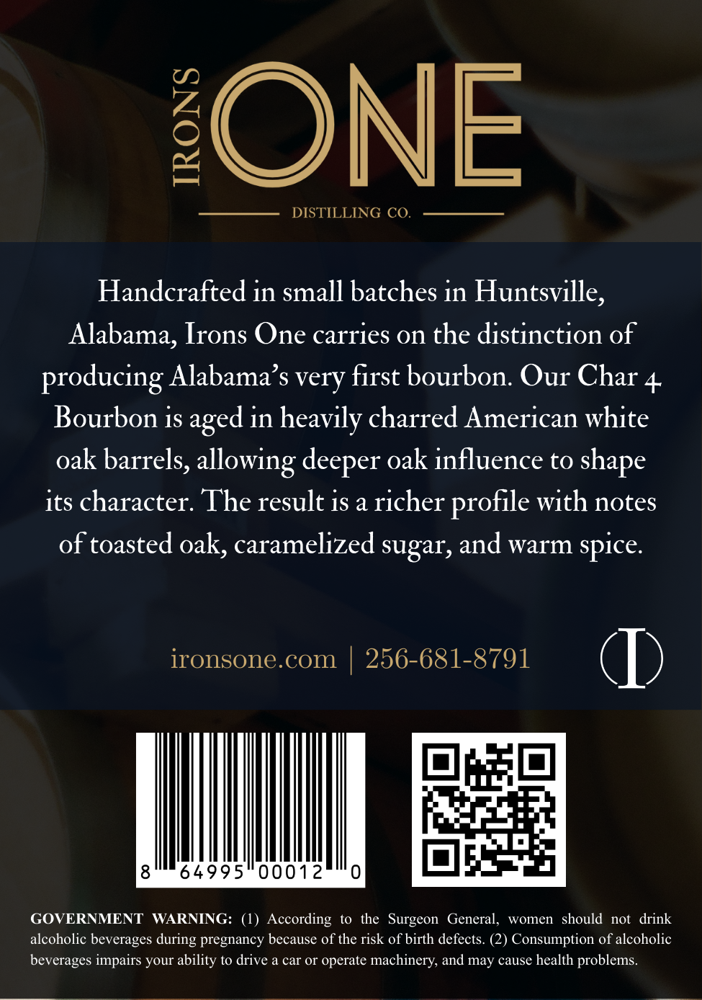

# TTB COLA Label Images - TTBID 26064001000719

**Brand Name:** IRONS ONE DISTILLERY

**Issue Date:** 03/10/2026

**Origin Code:** 10

**Product Class/Type:** 141

**Source:** [TTB Public COLA Registry](https://ttbonline.gov/colasonline/viewColaDetails.do?action=publicFormDisplay&ttbid=26064001000719)

## Label Images

### Back Label

## Extracted Label Text

*Text extracted via OCR - may contain errors*

### Back Label

ONE
DISTILLING CO.
Handcrafted in small batches in Huntsville;
Alabama, Irons One carries on the distinction of
producing Alabama's very first bourbon: Our Char 4
Bourbon is aged in heavily charred American white
oak barrels, allowing deeper oak influence to
its character. The result is a richer
with notes
of toasted oak, caramelized sugar, and warm
ironsone.com
256-681-8791
64995
00012
GOVERNMENT
WARNING:
(1) According
to the Surgeon
General,
women   should
not   drink
alcoholic beverages
pregnancy because of the risk of birth defects: (2) Consumption of alcoholic
beverages impairs your ability to drive a car Or operate machinery; and may cause health problems
shape
profile
spice
during
