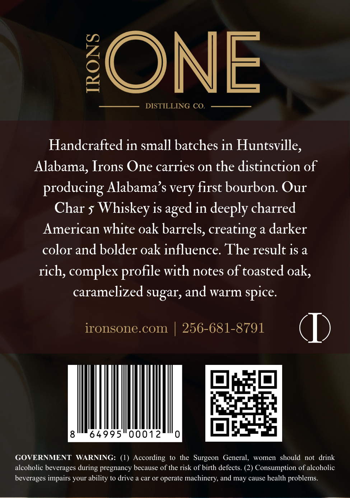
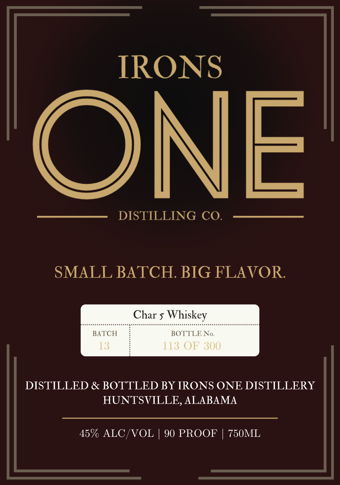

# TTB COLA Label Images - TTBID 26064001000728

**Brand Name:** IRONS ONE

**Issue Date:** 03/06/2026

**Origin Code:** 10

**Product Class/Type:** 140

**Source:** [TTB Public COLA Registry](https://ttbonline.gov/colasonline/viewColaDetails.do?action=publicFormDisplay&ttbid=26064001000728)

## Label Images

### Back Label

### Front Label

## Extracted Label Text

*Text extracted via OCR - may contain errors*

**Detected Proof:** 90

### Back Label

ONE
DISTILLING CO.
Handcrafted in small batches in Huntsville,
Alabama, Irons One carries on the distinction of
producing Alabama' $ very first bourbon: Our
Char 5
Whiskey is aged in deeply charred
American white oak barrels, creating a darker
color and bolder oak influence The result 1s a
rich, complex
with notes of toasted oak,
caramelized sugar, and warm spice:
ironsone.com
256-681-8791
64995
00012
GOVERNMENT
WARNING:
(1) According
to the Surgeon
General,
women   should
not   drink
alcoholic beverages
pregnancy because of the risk of birth defects: (2) Consumption of alcoholic
beverages impairs your ability to drive a car Or operate machinery; and may cause health problems
profile
during

### Front Label

IRONS

ONE

DISTILLING CO.

SMALL BATCH. BIG FLAVOR

Char 5 Whiskey

BATCH

BOTTLEN

DISTILLED & BOTTLED BY IRONS ONE DISTILLERY

HUNTSVILLE, ALABAMA

45% ALC/VOL | 90 PROOF | 750ML
