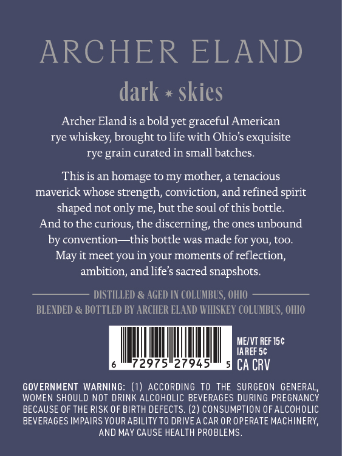
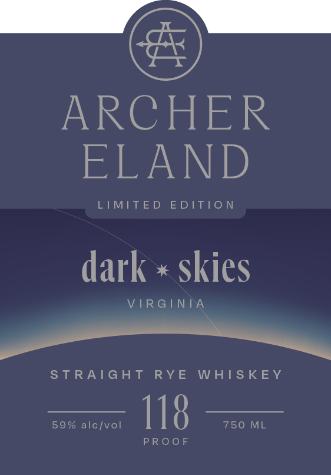

# TTB COLA Label Images - TTBID 26064001000740

**Brand Name:** ARCHER ELAND

**Issue Date:** 03/06/2026

**Origin Code:** 09

**Product Class/Type:** 102

**Source:** [TTB Public COLA Registry](https://ttbonline.gov/colasonline/viewColaDetails.do?action=publicFormDisplay&ttbid=26064001000740)

## Label Images

### Back Label

### Front Label

### Label 3

## Extracted Label Text

*Text extracted via OCR - may contain errors*

*1 image(s) excluded: text did not meet readability threshold*

### Back Label

ARCHER ELAND
dark
skies
Archer Eland is a bold yet graceful American
rye whiskey, brought to life with Ohio$ exquisite
rye grain curated in small batches_
This is an
homage to my mother; a tenacious
maverick whose strength; conviction, and refined spirit
shaped not only me; but the soul of this bottle
Andto the curious, the discerning, the ones unbound
by convention
-this bottle was made for you; too:
it meet you in your moments of
reflection;
ambition, and life'$ sacred snapshots.
DISTILLED & AGED IN COLUMBUS, OHIO
BLENDED & BOTTLED BY ARCHER ELAND WHISKEY COLUMBLS , OHIO
MEXVT REF 15c
IAREF 5c
72975"27945'
CA CRV
GOVERNMENT WARNING: (1) AccORDING TO THE SURGEON GENERAL,
WOMEN SHOULD NOT DRINK ALCOHOLIC BEVERAGES DURING PREGNANCY
BECAUSE OF THE RISK OF BIRTH DEFECTS. (2) CONSUMPTION OFALCOHOLIC
BEVERAGES IMPAIRS YOURABILITY TO DRIVEA CAR OR OPERATE MACHINERY,
AND MAY CAUSE HEALTH PROBLEMS
May

### Front Label

ee
ARCHER
eee NED)
LIMITED EDITION
dark * skies
VIRGINIA
EE.
STRAIGHT RYE WHISKEY
