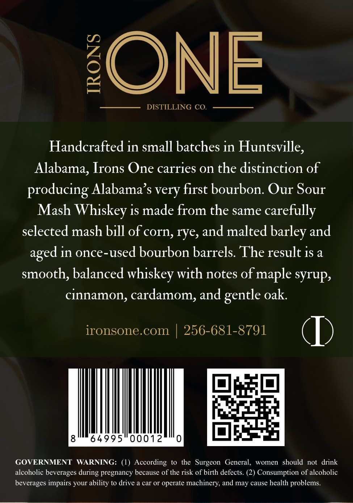
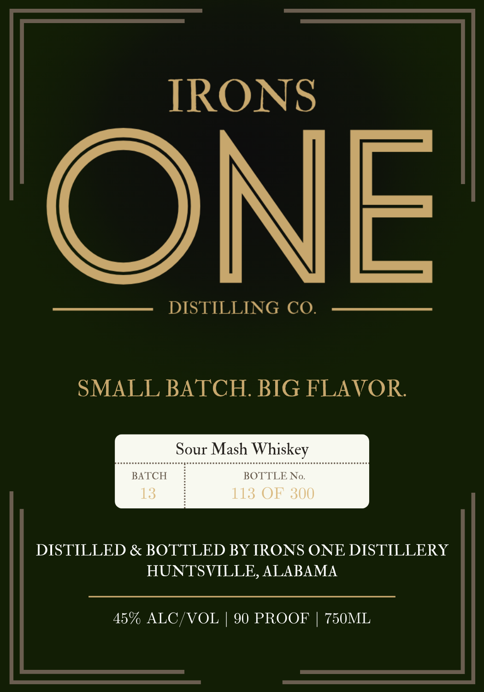

# TTB COLA Label Images - TTBID 26064001000741

**Brand Name:** IRONS ONE

**Issue Date:** 03/06/2026

**Origin Code:** 10

**Product Class/Type:** 140

**Source:** [TTB Public COLA Registry](https://ttbonline.gov/colasonline/viewColaDetails.do?action=publicFormDisplay&ttbid=26064001000741)

## Label Images

### Back Label

### Front Label

## Extracted Label Text

*Text extracted via OCR - may contain errors*

**Detected Proof:** 90

### Back Label

ONE
DISTILLING CO.
Handcrafted in small batches in Huntsville,
Alabama, Irons One carries on the distinction of
producing Alabama s very first bourbon. Our Sour
Mash Whiskey is made from the same carefully
selected mash bill of cOrn, rye, and malted barley and
in once-used bourbon barrels. The result is a
smooth; balanced whiskey with notes of maple syrup;
cinnamon, cardamom, and
oak
ironsone. com
256-681-8791
64995
00012
GOVERNMENT
WARNING:
(1) According
to the Surgeon
General,
women   should
not   drink
alcoholic beverages
pregnancy because of the risk of birth defects: (2) Consumption of alcoholic
beverages impairs your ability to drive a car Or operate machinery; and may cause health problems
aged
gentle
during

### Front Label

IRONS

ONE

DISTILLING CO.

SMALL BATCH. BIG FLAVOR

Sour Mash Whiskey

TCH

BOTTLE No.

DISTILLED & BOTTLED BY IRONS ONE DISTILLERY

HUNTSVILLE, ALABAMA

45% ALC/VOL | 90 PROOF | 750ML
