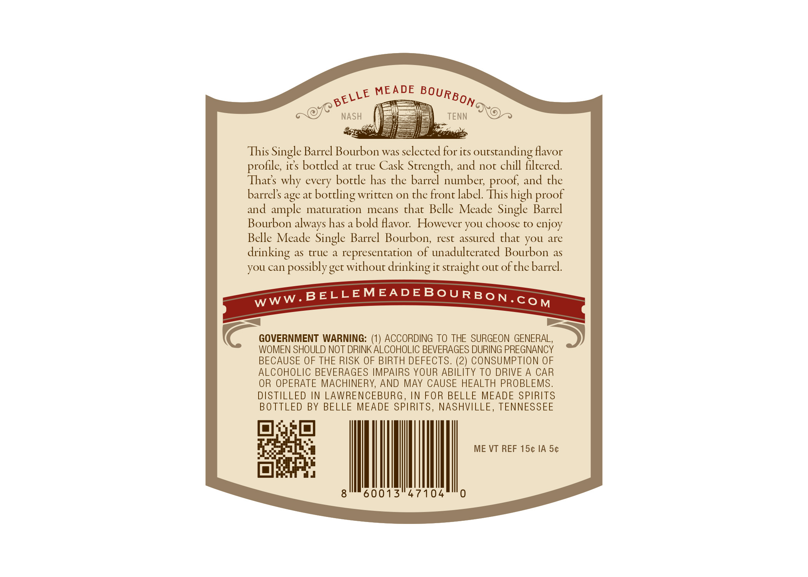
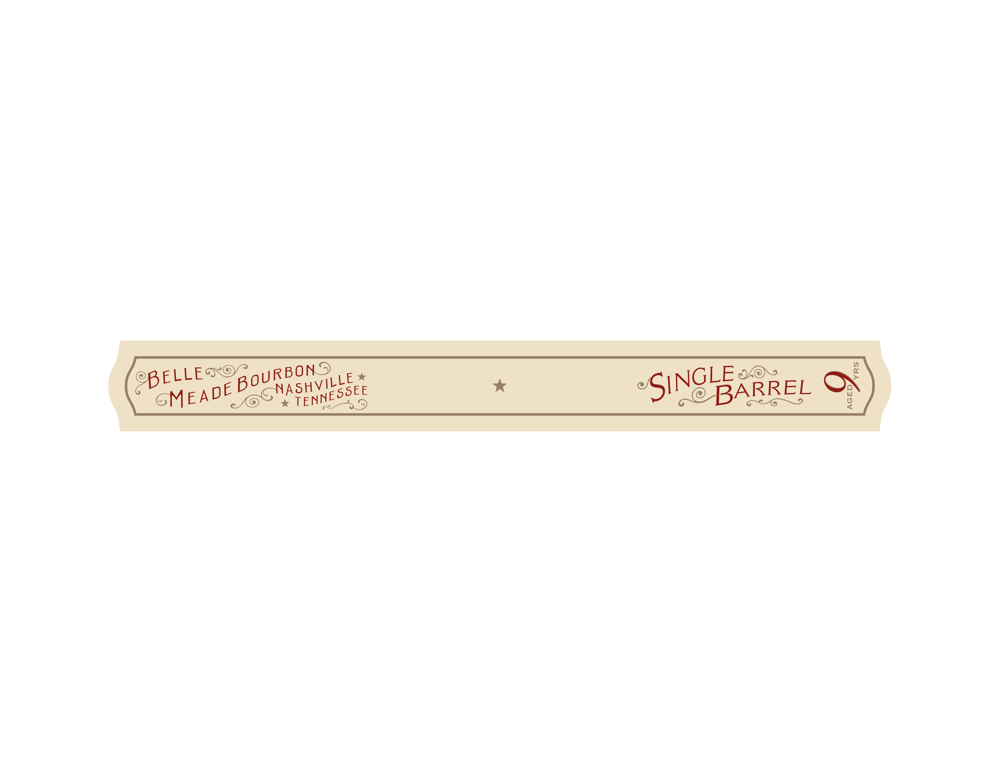

# TTB COLA Label Images - TTBID 26064001000831

**Brand Name:** BELLE MEADE

**Fanciful Name:** SINGLE BARREL

**Issue Date:** 03/09/2026

**Origin Code:** 43

**Product Class/Type:** 101

**Source:** [TTB Public COLA Registry](https://ttbonline.gov/colasonline/viewColaDetails.do?action=publicFormDisplay&ttbid=26064001000831)

## Label Images

### Back Label

### Label 2

## Extracted Label Text

*Text extracted via OCR - may contain errors*

### Back Label

MEADE
NASH
TENN
This Single Barrel Bourbon was selected for its
outstanding Havor
profile; ics boctled at true Cask Strength; and noc chill filtered
Thats why every bottle has the barrel number; proof; and the
barrels age at
boctling written 0n che front label Thishigh
and ample maturation
means
that Belle Meade Single Barrel
Bourbon always has a bold favor:  However you choose to enjoy
Belle Meade Single Barrel Bourbon,
rest
that you are
drinking
as
true a
representation of unadulterated Bourbon
as
you can possibly get without drinking it straight out ofche barrel.
BELLEMEADEBoURBON.CoM
GOVERNMENT WARNING:
ACCORDING TO THE SURGEON GENERAL,
WOMEN SHOULD NOT DRINK ALCOHOLIC BEVERAGES DURING PREGNANCY
BECAUSE OF THE RISK OF BIRTH DEFECTS. (2) CONSUMPTION OF
ALCOHOLIC BEVERAGES IMPAIRS YOUR ABILITY TO DRIVE A
CAR
OR OPERATE MACHINERY, AND MAY CAUSE HEALTH PROBLEMS.
DISTILLED IN LAWRENCEBURG , IN FOR BELLE MEADE SPIRITS
BOTTLED BY BELLE MEADE SPIRITS, NASHVILLE, TENNESSEE
ME VT REF 154 IA 5c
8'
60013"47104
0
BOURBON
BELLE
proof
assured
WWW _

### Label 2

2
8
BoURBONS
SINGLE
BELLE=
NASHVILLE
BARREL
MEADE
TENNESSEE
