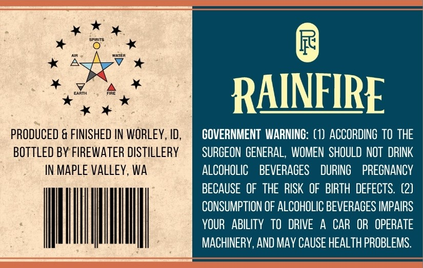
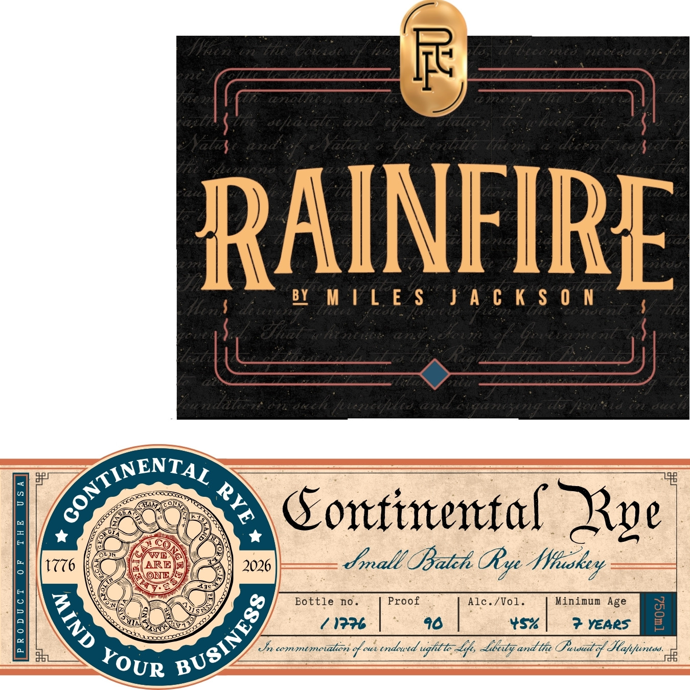

# TTB COLA Label Images - TTBID 26065001000014

**Brand Name:** RAINFIRE

**Fanciful Name:** CONTINENTAL RYE

**Issue Date:** 03/10/2026

**Origin Code:** 07

**Product Class/Type:** 142

**Source:** [TTB Public COLA Registry](https://ttbonline.gov/colasonline/viewColaDetails.do?action=publicFormDisplay&ttbid=26065001000014)

## Label Images

### Back Label

### Front Label

### Label 3

## Extracted Label Text

*Text extracted via OCR - may contain errors*

*1 image(s) excluded: text did not meet readability threshold*

### Back Label

RAINFIRE
PRODUCED & FINISHED IN WORLEY, ID ,
GOVERNMENT  WARNING: (1)   ACCORDING TO THE
BOTTLED BY FIREWATER DISTILLERY
SURCEON GENERAL ,  WOMEN SHOULD NOT  DRINK
IN MAPLE VALLEY, WA
ALCOHOLIC
BEVERAGES
DURINC
PREGNANCY
BECAUSE  OF  THE RISK OF BIRTH  DEFECTS. (2)
CONSUMPTION OF ALCOHOLIC BEVERAGES IMPAIRS
YOUR   ABILITY   tO  DRIVE
A CAR OR  OPERATE
MACHINERY , AND MAv CAUSE HEALTH PROBLEMS:

### Front Label

ffuen
Vd
ZLC
bocidd
7ire
nceada1
F7n
F
d
Sea
L
4967764
GA
L
0771075
77
ACLTAd
Z
G,lI
Sc.sehatale
eaal
slali6ni
Z
7
Tcc [
7h6
Xatzs
and & Yatau
L etitte Acr,
dicentricd;
e77-C
Te' exhntona
dactaxe tk
RAINFIPE
BY
M |L E $
J A c K $ 0 n
Mcn=
detcei
ZL&
Tad
LOit 6
Ueenle
7
CLl
Ehat
Keneues
Ca;
dovieGvenonent
Cnia
egta
ToUe
l
77
P'
7us
V
7
datto:
Gc
[enahls and iqane
LS
724t
0
8tech
#P
1
Gontittenttal Zpe
17
ARE
2026
fmall OBatch (Rye
Bottle
no
Proof
Alc./ Vol_
Minimum
Age
2
1776
90
YS%
Years
%
cemmecialicn d cuendrutd ughtt Lfs ~baty andtn Oatoaat d Slaffuntae
Cyoa
and
47a
"Rx4
'
Ghan
GONTINENTA
3
WNhuoskey
RUSINESS
3
YOUR
