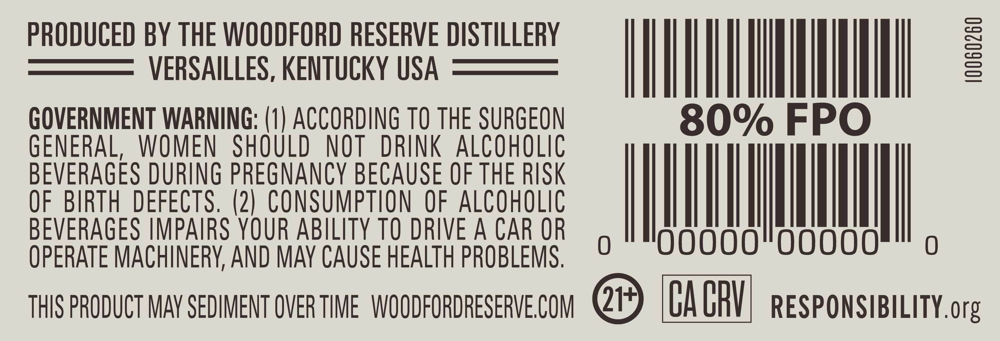
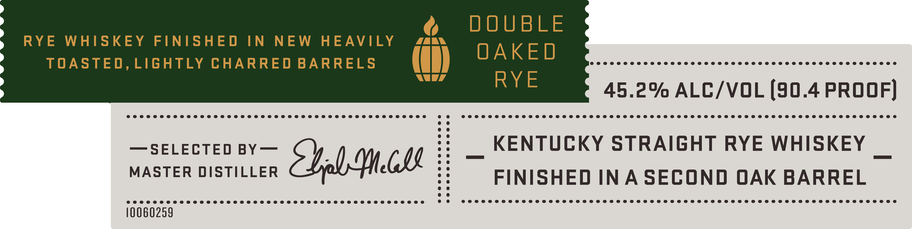
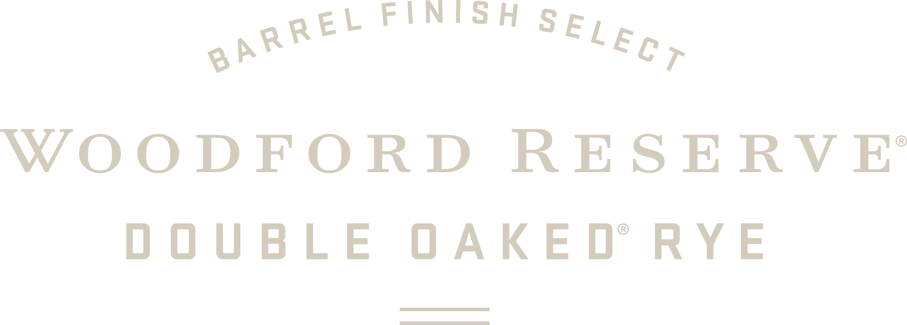

# TTB COLA Label Images - TTBID 26065001000088

**Brand Name:** WOODFORD RESERVE

**Fanciful Name:** DOUBLE OAKED RYE

**Issue Date:** 03/11/2026

**Origin Code:** 22

**Product Class/Type:** 102

**Source:** [TTB Public COLA Registry](https://ttbonline.gov/colasonline/viewColaDetails.do?action=publicFormDisplay&ttbid=26065001000088)

## Label Images

### Back Label

### Front Label

### Label 1

### Label 4

### Label 5

## Extracted Label Text

*Text extracted via OCR - may contain errors*

*2 image(s) excluded: text did not meet readability threshold*

**Detected Proof:** 90.4

### Back Label

PRODUCED BY THE WOODFORD RESERVE DISTILLERY
VERSAILLES, KENTUCKY USA
1
GOVERNMENT WARNING: (1) ACCORDING TO THE SURGEON
80% FPO
GENERAL,
WOMEN
SHOULD
NOT
DRINK alcoholic
BEVERAGES DURING PREGNANCY BECAUSE OF THE RISK
OF  BIRTH DEFECTS, (2| CONSUMPTION OF ALCOHOLIC
BEVERAGES IMPAIRS YOUR ABILITY TO DRIVE A CAR OR
0
oooo"ooooo
OPERATE MACHINERY, AND MAY CAUSE HEALTH PROBLEMS.
THIS PRODUCT MAv SEDIMENT OVER TIME   WOODFORDRESERVE COM
2
CA CRV
RESPONSIBILITY.org

### Front Label

@

DOUBLE

RYE WHISKEY FINISHED IN NEW HEAVILY

r/ LAN

TOASTED, LIGHTLY CHARRED BARRELS

(i) OAKED

e@eeaoeeeaeaeaceaeaeoeaeaeaeseeaoeceeaoeaeaeaecaoeaoeaoecoeaeaeoaceaece@ecsoeaeae@oaceaoeaea eee ee

RYE

45.2% ALC/VOL (90.4 PROOF)

e@ee@eeeeaeaoeeaoeoeeoeeaoeeceeaoeceeaeaoeaoeaoece aoe oecoeoecoeaeseceeaoeceeae eee oeae eee d ee e@eeeaeeaeaeaceaeaeceaeaeaeaeeaoeaeseeeceeaeceaeaeoaes eae ea@eaceo@e@oeaeaceaeceaceaeeacaeaecoaeas eae eaceaeaseeaeac eae @e@oeaeeaee

KENTUCKY STRAIGHT RYE WHISKEY

—SELECTED BY—

MASTER DISTILLER

Slr Mie

FINISHED INA SECOND OAK BARREL

eeeeae@aeeaeeceeeeeoecoeaoeoeceeoeeeea eee eceoeaceoe@eoeooacoea eos eeoeae ee ece ee eeeeeeeeeeeeoeaoeoeeeeeeeeeeeceeeaeeoeseeeececeeaeeeeoeeeeeeeeeeeeeeeeeeoeoeaeeoeeeed

10060259

### Label 1

e

QREL FINISH SE,

WOODFORD RESERVE

DOUBLE OAKED RYE

EEE

De
