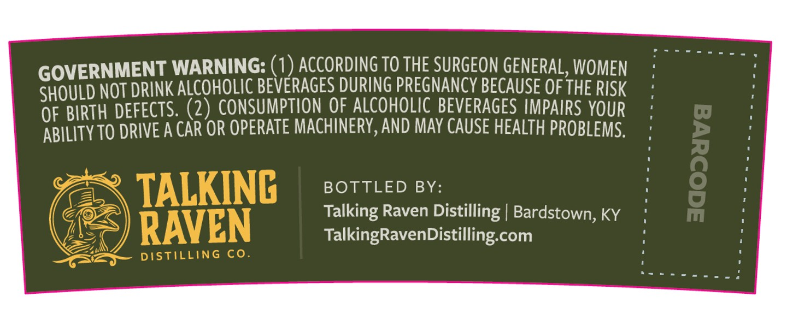
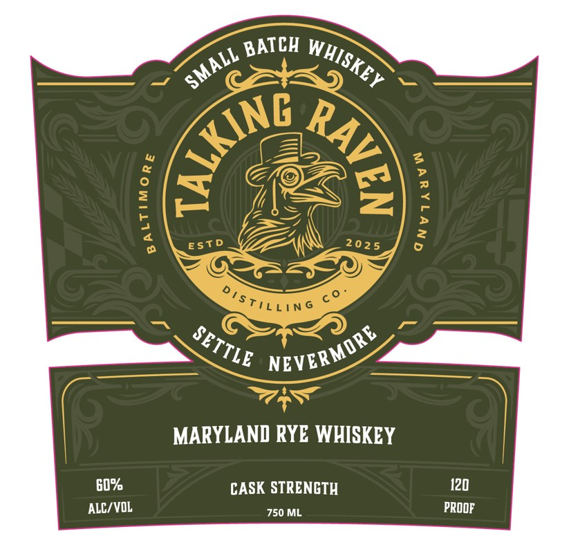

# TTB COLA Label Images - TTBID 26065001000194

**Brand Name:** TALKING RAVEN

**Issue Date:** 03/16/2026

**Origin Code:** 22

**Product Class/Type:** 142

**Source:** [TTB Public COLA Registry](https://ttbonline.gov/colasonline/viewColaDetails.do?action=publicFormDisplay&ttbid=26065001000194)

## Label Images

### Back Label

### Front Label

## Extracted Label Text

*Text extracted via OCR - may contain errors*

### Back Label

GOVERNMENT WARNING: (1) ACCORDING To THE SURGEON GENERAL,WOMEN
SHOuLd NOT drInK ALCoHOLIC BEVERAGES DURING PREGNANCY BECAUSE OF THE RISK
OF BIRTH DEFECTS: (2) ConSumptIoN QF ALCOHOLIc BEVERAGES IMPAIRS YOUR
ABILITY TO DRIVE A CAR OR OPERATE MACHINERV,AND MAY CAUSE HEALTH PROBLEMS.
TALKING
BOTTLED BY:
[
Talking Raven Distilling | Bardstown; KY
RAVEN
TalkingRavenDistilling com
DISTILLING
co

### Front Label

BATCH
2
025
MARYLAND RYE WHISKEY
G0%
CASK STRENCTH
120
ALC/VOL
750 ML
PROOF
WHISKEY
SMALL
({
9
1
2
1
ESTD
DisTiLLiN
SETTLE
NEVERMORE
