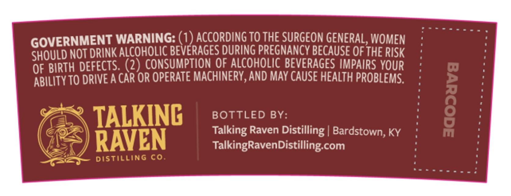
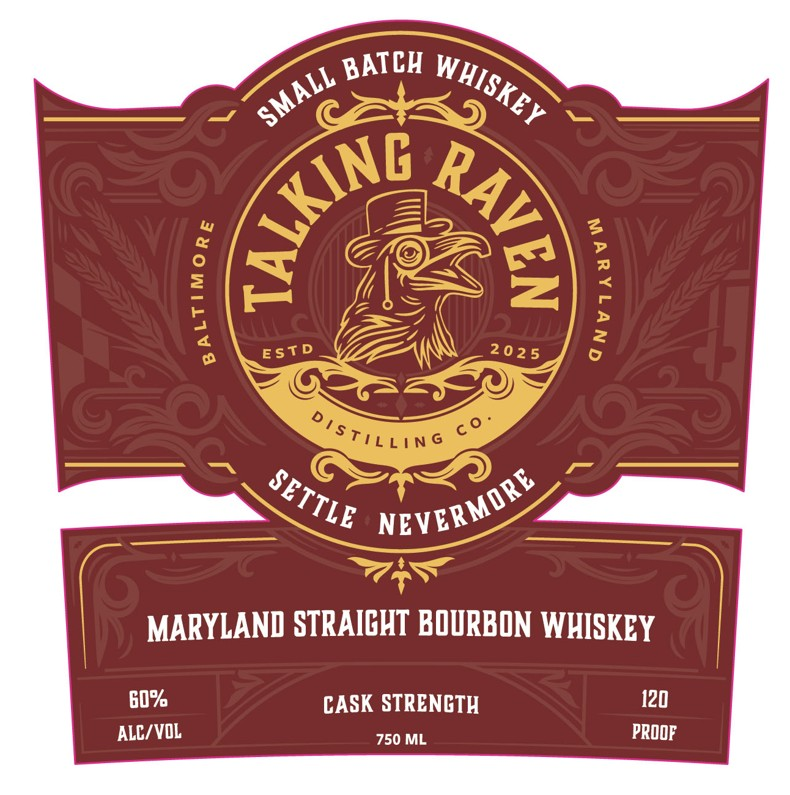

# TTB COLA Label Images - TTBID 26065001000205

**Brand Name:** TALKING RAVEN

**Issue Date:** 03/16/2026

**Origin Code:** 22

**Product Class/Type:** 101

**Source:** [TTB Public COLA Registry](https://ttbonline.gov/colasonline/viewColaDetails.do?action=publicFormDisplay&ttbid=26065001000205)

## Label Images

### Back Label

### Front Label

## Extracted Label Text

*Text extracted via OCR - may contain errors*

### Back Label

GOVERNMENT WARNING: (1) AccORdING TO THE SURGEON GENERAL,WOMEN
SHOULD NOT DRINK ALCOHOLIC BEVERAGES DuRING PREGMANCY BECAUSE Of The RISK
OF BIRTH DEFECTS. (2) consumptIoN QF_ALCOHOLIc BEVERAGES IMPaiRS YOUR
ABILITy TO DRIVE A CAR OR OPERATE MACHINERY, AND May CAUSE HEAlTh PROBLeMs.
TALKING
BOTTLED BY:
[
Talking Raven Distilling | Bardstown, KY
RAVEN
TalkingRavenDistilling com
Distilling Co

### Front Label

BATCH
'02 5
MARYLAND STRAICHT BOURBON WHISKEY
G0%
CASK STRENCTH
120
ALC/VOL
750 ML
PROOF
WHISKEY
SMALL
{
9
:
@
1
3
ESTD
DiSTILLiNG
SETTLE
MORE
NEVERL
