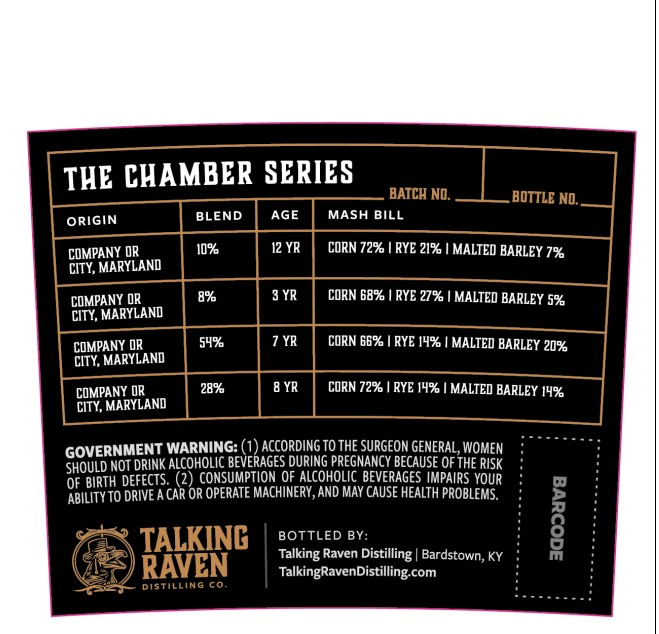
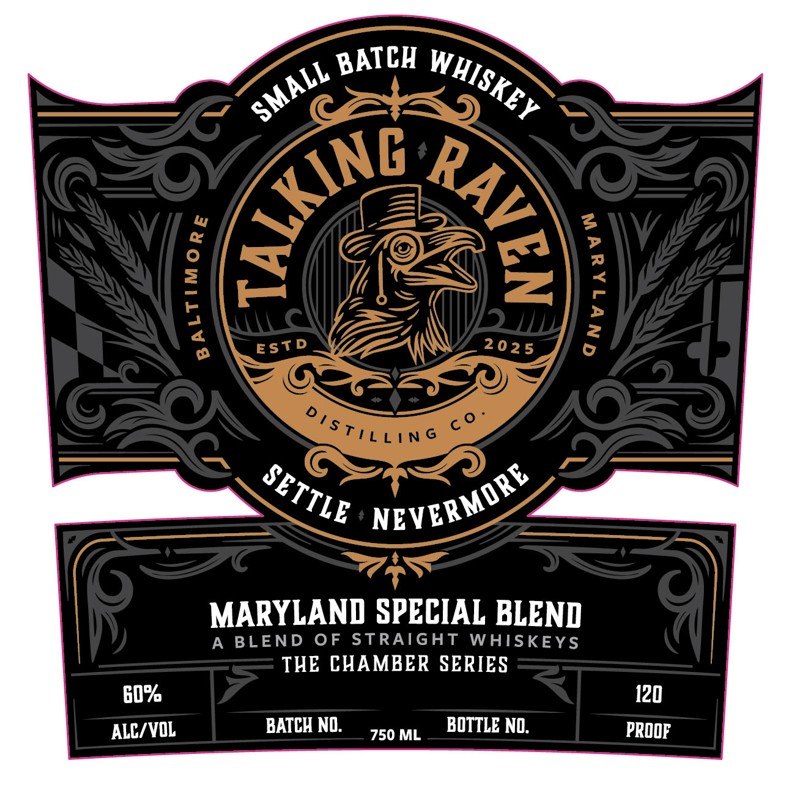

# TTB COLA Label Images - TTBID 26065001000207

**Brand Name:** TALKING RAVEN

**Issue Date:** 03/16/2026

**Origin Code:** 22

**Product Class/Type:** 120

**Source:** [TTB Public COLA Registry](https://ttbonline.gov/colasonline/viewColaDetails.do?action=publicFormDisplay&ttbid=26065001000207)

## Label Images

### Back Label

### Front Label

## Extracted Label Text

*Text extracted via OCR - may contain errors*

**Detected Proof:** 108
**Detected Age:** 3 Years

### Back Label

THE CHAMBER SERIES
BATCH NO.
BOTTLE ND,
ORIGIN
BLEND
AGE
MASH BILL
COMPANY DR
10%
CORN 72% ! RYE 21% | MALTED BARLEY 7%
CITY, MARYLAND
COMPANY OR
8%
3 YR
CORN 68%
RYE 27% | MALTED BARLEY 5%
CITY, MARYLAND
COMPANY OR
54%
7 YR
CORN 66%
RYE 14%
MALTED BARLEY 20%
City, MARYLAND
COMPANY OR
28%
8 YR
CORN 72%
RYE 149
MALTED BARLEY 14%
CITY, MARYLAND
GOVERNMENT WARNING: (2) AccordinG TOTHE SuRGeON GENERAL,WOMEN
SHOULD NOT DRINK ALCOHOLIC BEVERAGES DURING PREGNANCY BECAUSE QF THE RISK
OF BIRTH DEFECTS (2
CONSUMPTION OF ALCOHOLIC BEVERAGES IMPAIRS YOUR
ABILITY TO DRIVE A CAR OR OPERATE MACHINERY, AND May CAUSE HEALTh PROBLEMS.
TALKING
BOTTLED BY:
L
Talking Raven Distilling | Bardstown, KY
RAVEN
TalkingRavenDistilling com
DiStilliNG co
12 YR

### Front Label

2
EST D
MARYLAND SPECIAL BLEND
A BLEND OF STRAIGHT WAISKEYS
THE CHAMBER SERIES
G0%
120
ALC/VOL
BATCH NO:
750 ML
BOTTLE NO:
PROOF
BATCH
WHISKEY
SMALL
{
9
@
:
1
2
202 5
DisTiLLin G
NEVERMORE
SETTLE
