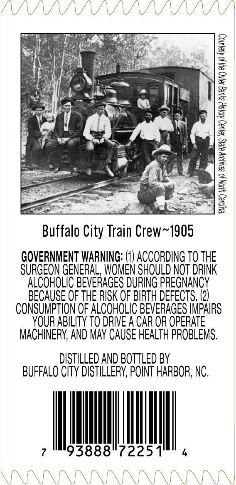
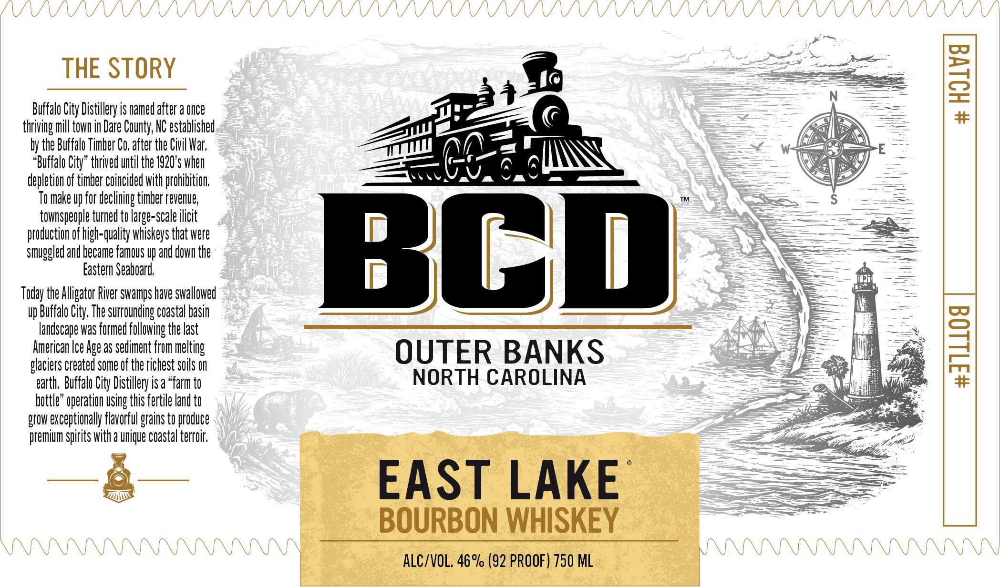
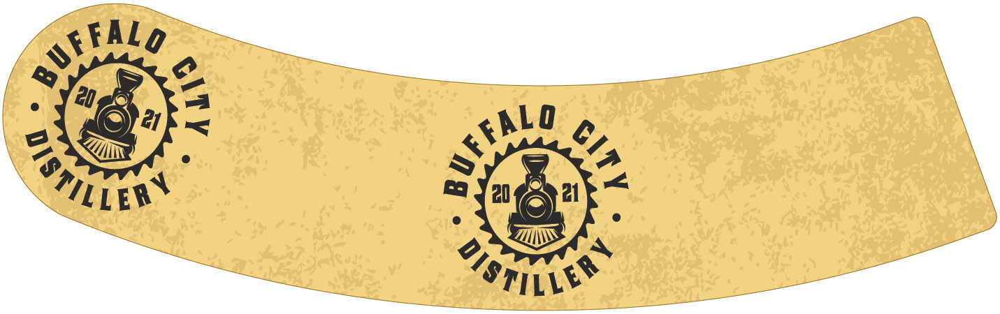

# TTB COLA Label Images - TTBID 26065001000221

**Brand Name:** BCD

**Issue Date:** 03/06/2026

**Origin Code:** 35

**Product Class/Type:** 141

**Source:** [TTB Public COLA Registry](https://ttbonline.gov/colasonline/viewColaDetails.do?action=publicFormDisplay&ttbid=26065001000221)

## Label Images

### Back Label

### Front Label

### Label 3

## Extracted Label Text

*Text extracted via OCR - may contain errors*

*1 image(s) excluded: text did not meet readability threshold*

**Detected Proof:** 92

### Back Label

ue0 Alo syueg ey 2440 seyn0g

Buffalo City Train Crew~1905

GOVERNMENT WARNING: (1) ACCORDING T0 THE
SURGEON GENERAL, WOMEN SHOULD NOT DRINK
ALCOHOLIC BEVERAGES DURING PREGNANCY
BECAUSE OF THE RISK OF BIRTH DEFECTS. (2)
CONSUMPTION OF ALCOHOLIC BEVERAGES IMPAIRS
YOUR ABILITY TO DRIVE A CAR OR OPERATE
MACHINERY, AND MAY CAUSE HEALTH PROBLEMS.

DISTILLED AND BOTTLED BY
BUFFALO CITY DISTILLERY, POINT HARBOR, NC.

7 9388872251" 4

### Front Label

THE STORY

Buffa
thriving

“Buff

duc
Smulgg

Today th

Amer
olacie

bott
grow e
premi

by the Buffalo Timber Co, a
ti
depletion of timber coincided with prot

O make up for declining timber revenu
townspeople turned ic

Buffalo City, The s
andscape was formed

earth, Buffalo City Distillery is a “farm t

City Distillery is named after a once
ll town in Dare County, NC established
Co. after the Civil War,
il the 1920's whe
ition.
e,

to large-scale ilicit
tion of high-quality whiskeys that were
ed! and became famous up and down the
Eastern Seaboard,

e Alligator River swamps have swallowed

rounding coastal basi
following the last
can Ice Age as sediment from melting
S created some of the richest soils

m

alo City” thrived u

e” operation using this fertile land ti
xceptionaly flavorful grains to produce
m spirits with @ unique coastal terrai

»%

A

_——

— | ™
BC

OUTER BANKS
NORTH CAROLINA

EAST LAKE
BOURBON WHISKEY

ALC/VOL. 46% (92 PROOF) 750 ML
