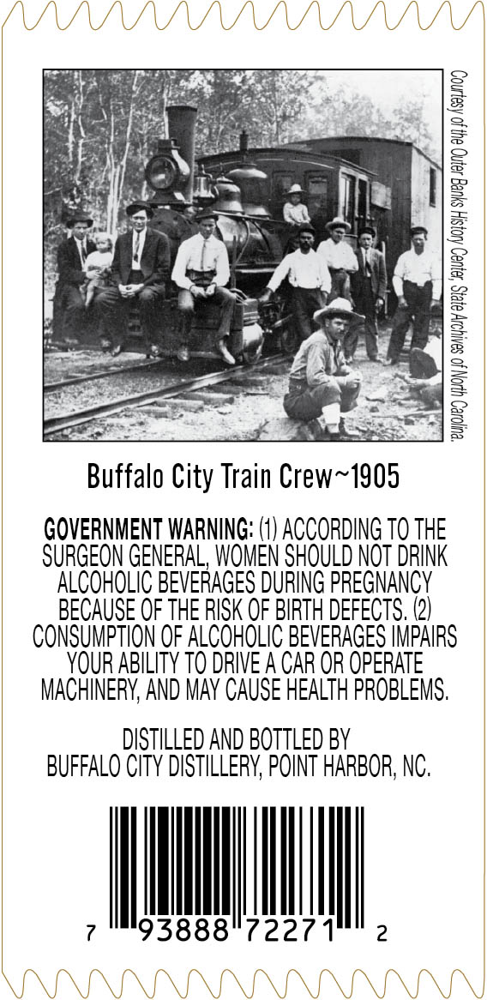
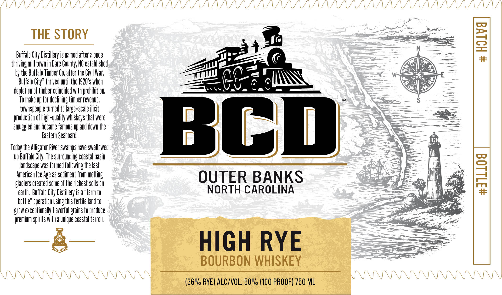
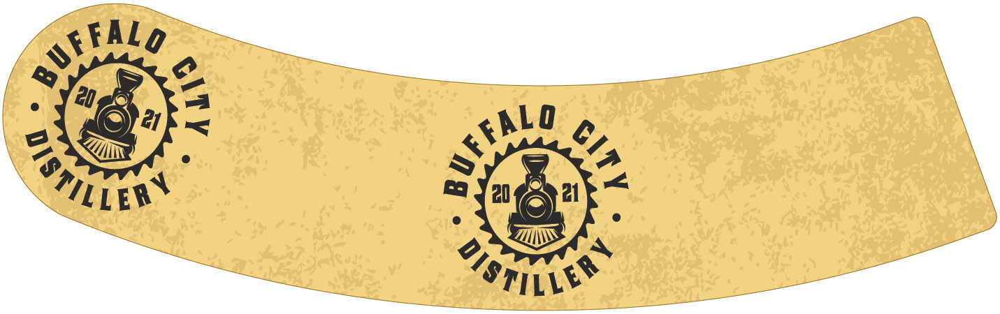

# TTB COLA Label Images - TTBID 26065001000231

**Brand Name:** BCD

**Issue Date:** 03/06/2026

**Origin Code:** 35

**Product Class/Type:** 141

**Source:** [TTB Public COLA Registry](https://ttbonline.gov/colasonline/viewColaDetails.do?action=publicFormDisplay&ttbid=26065001000231)

## Label Images

### Back Label

### Front Label

### Label 3

## Extracted Label Text

*Text extracted via OCR - may contain errors*

*1 image(s) excluded: text did not meet readability threshold*

**Detected Proof:** 100

### Back Label

Buffalo City Train Crew~1905

GOVERNMENT WARNING: (1) ACCORDING T0 THE
SURGEON GENERAL, WOMEN SHOULD NOT DRINK
ALCOHOLIC BEVERAGES DURING PREGNANCY
BECAUSE OF THE RISK OF BIRTH DEFECTS. (2)
CONSUMPTION OF ALCOHOLIC BEVERAGES IMPAIRS
YOUR ABILITY TO DRIVE A CAR OR OPERATE
MACHINERY, AND MAY CAUSE HEALTH PROBLEMS.

DISTILLED AND BOTTLED BY
BUFFALO CITY DISTILLERY, POINT HARBOR, NC.

i bier

7 93888° 7227

### Front Label

THE STORY

by the Buffalo Timber Co, a

O make up for declining timber revenu
townspeople turned ic

Buffalo City, The s
andscape was formed

iers created some of
earth, Buffalo City Distillery is a “farm t

Brow exceptionally flavorful grains to produce
ium spirits with a unique coastal terroi

City Distillery is named after a once
mill town in Dare County, NC established
Co. after the Civil War,
alo City” thrived until the 1920's whe
ion of timber coincided with prohibition,
e,
to large-scale ilicit
tion of high-quality whiskeys that were
ed! and became famous up and down the
Eastern Seaboard,

e Alligator River swamps have swallowed
rounding coastal basi

following the last
ican Ice Age as sediment from melting
the richest soils

e” operation using this fertile land ti

»%

A

_——

BC

OUTER BANKS
NORTH CAROLINA

HIGH RYE

BOURBON WHISKEY

(36% RYE) ALC/VOL. 50% (100 PROOF) 750 ML

we
