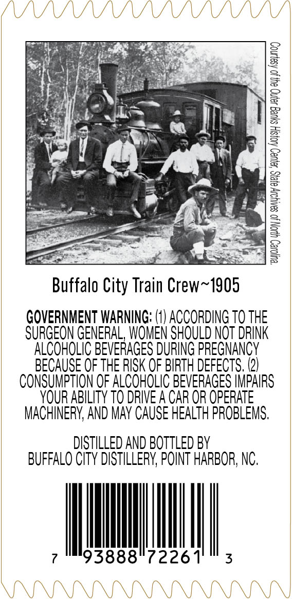
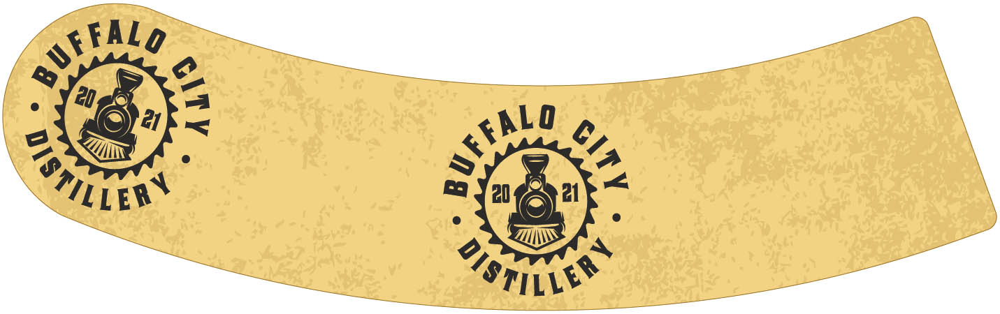

# TTB COLA Label Images - TTBID 26065001000240

**Brand Name:** BCD

**Issue Date:** 03/09/2026

**Origin Code:** 35

**Product Class/Type:** 101

**Source:** [TTB Public COLA Registry](https://ttbonline.gov/colasonline/viewColaDetails.do?action=publicFormDisplay&ttbid=26065001000240)

## Label Images

### Back Label

### Label 3

## Extracted Label Text

*Text extracted via OCR - may contain errors*

*1 image(s) excluded: text did not meet readability threshold*

### Back Label

ee

Se \

Nees

—=—

AN

a’

Buffalo City Train crew~1905

GOVERNMENT WARNING: (1) ACCORDING T0 THE

SURGEON GENERAL, WOMEN SHOULD NOT DRINK

ALCOHOLIC BEVERAGES DURING PREGNANCY

BECAUSE OF THE RISK OF BIRTH DEFECTS. (2)

CONSUMPTION OF ALCOHOLIC BEVERAGES IMPAIRS

YOUR ABILITY TO DRIVE A CAR OR OPERATE

MACHINERY, AND MAY CAUSE HEALTH PROBLEMS.

DISTILLED AND BOTTLED BY

BUFFALO CITY DISTILLERY, POINT HARBOR, NC.

|

|

7

alia eee 3
