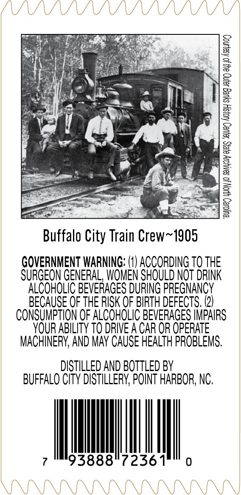
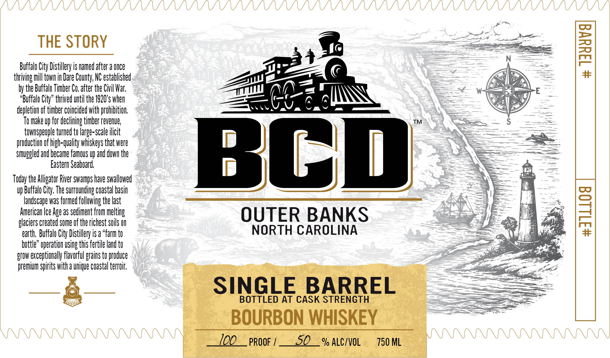
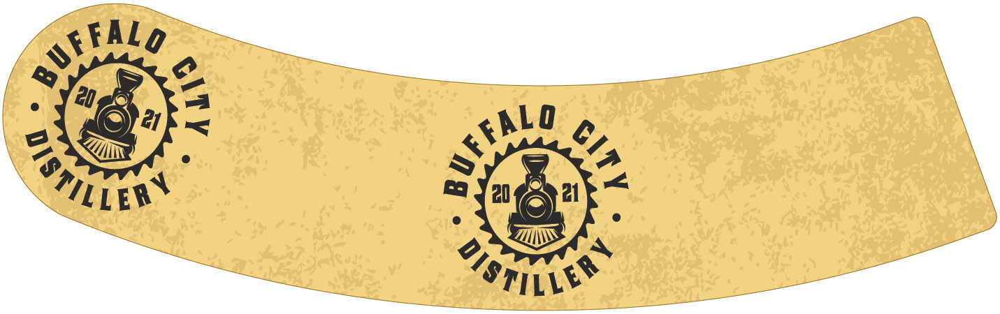

# TTB COLA Label Images - TTBID 26065001000244

**Brand Name:** BCD

**Issue Date:** 03/12/2026

**Origin Code:** 35

**Product Class/Type:** 101

**Source:** [TTB Public COLA Registry](https://ttbonline.gov/colasonline/viewColaDetails.do?action=publicFormDisplay&ttbid=26065001000244)

## Label Images

### Back Label

### Front Label

### Label 3

## Extracted Label Text

*Text extracted via OCR - may contain errors*

*1 image(s) excluded: text did not meet readability threshold*

### Back Label

1 Jue oyop syueg Jn 24,0 Asaynog

Buffalo City Train Crew~1905

GOVERNMENT WARNING: (1) ACCORDING T0 THE
SURGEON GENERAL, WOMEN SHOULD NOT DRINK
ALCOHOLIC BEVERAGES DURING PREGNANCY
BECAUSE OF THE RISK OF BIRTH DEFECTS. (2)
CONSUMPTION OF ALCOHOLIC BEVERAGES IMPAIRS
YOUR ABILITY TO DRIVE A CAR OR OPERATE
MACHINERY, AND MAY CAUSE HEALTH PROBLEMS.

DISTILLED AND BOTTLED BY
BUFFALO CITY DISTILLERY, POINT HARBOR, NC.

7 Mil

### Front Label

yi

oom

THE STORY

»%

Buffalo City Distillery is named after a once

Z|

thriving mill town in Dare County, NC established

A

Ys}

\

by the Buffalo Timber Co. after the Civil War,

_——

E-

“Buffalo City” thrived until the 1920's whe

y

depletion of timber coincided with prohibition.

‘a

To make up for declining timber revenue,

— §

townspeople turned to large-scale ilicit

ducti

f high-quality whiskeys that were

smuggled and became famous up and down the

Eastern Seaboard,

[isall)

dai

Today the Alligator River swamps have swallowed

it Fi

Buffalo City, The surrounding coastal basi

andscape was formed following the last

American Ice Age as sediment from melting

glaciers created some of the richest soils

OUTER BANKS

earth, Buffalo City Distillery is a “farm t

NORTH CAROLINA

bottle” operation using this fertile land t

grow exceptionally flavorful grains to produce

premium spirits with @ unique coastal terroir.

=

YW

e&

SINGLE BARREL

LLUWs

BOTTLED AT CASK STRENGTH

=

BOURBON WHISKEY

100__ proof /__5O _ % ALc/voL

730 ML

|
