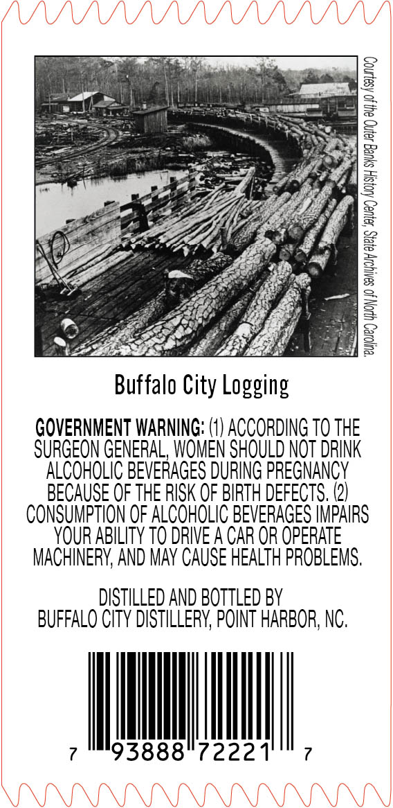
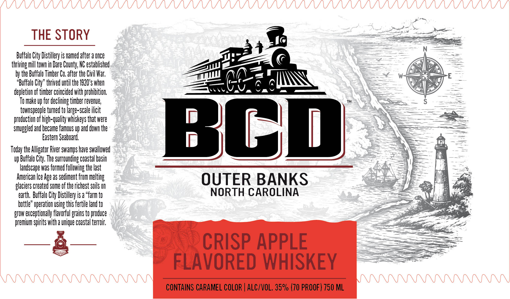
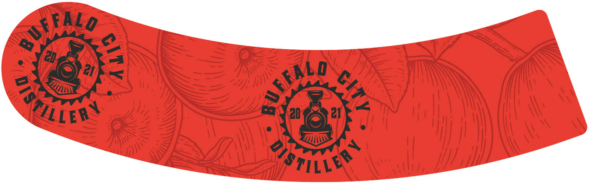

# TTB COLA Label Images - TTBID 26065001000270

**Brand Name:** BCD

**Issue Date:** 03/06/2026

**Origin Code:** 35

**Product Class/Type:** 149

**Source:** [TTB Public COLA Registry](https://ttbonline.gov/colasonline/viewColaDetails.do?action=publicFormDisplay&ttbid=26065001000270)

## Label Images

### Back Label

### Front Label

### Label 3

## Extracted Label Text

*Text extracted via OCR - may contain errors*

*1 image(s) excluded: text did not meet readability threshold*

**Detected Proof:** 140

### Back Label

Buffalo City Logging

GOVERNMENT WARNING: (1) ACCORDING T0 THE
SURGEON GENERAL, WOMEN SHOULD NOT DRINK
ALCOHOLIC BEVERAGES DURING PREGNANCY
BECAUSE OF THE RISK OF BIRTH DEFECTS. (2)
CONSUMPTION OF ALCOHOLIC BEVERAGES IMPAIRS
YOUR ABILITY TO DRIVE A CAR OR OPERATE
MACHINERY, AND MAY CAUSE HEALTH PROBLEMS.

DISTILLED AND BOTTLED BY
BUFFALO CITY DISTILLERY, POINT HARBOR, NC.

ven 7

7 93888 7222

### Front Label

THE STORY
Buffalo City Distillery is named after a Once
thriving mill towh in Dare County; NC established
by the Buffalo Timber Co, after the Civil War;
"Buffalo City" thrived until the 1920*s When
depletion of timber coincided with prohibition
To make up for declining timber revenue;
townspeople turned to large-scale ilicit
Jghxnuelunwadnonur
Bop
Eastern Seaboard;,
Today the Alligator River swamps have swallowed
Vp Buffalo City, The surrownding coastal basin
landscape was formed following the last
American Ice Age 2S sediment from melting
OUTER BANKS
glaciers created some of the richest sils On
earth;  Buffalo City Distillery is a "farm to
NORTH CAROLINA
bottle" operation Using this fertile land to
grOw exceptionally flavorful grains to produce
premium spirits with a nique coastal terroir;
CRISP APPLE
FLAVORED WHISKEY
CONTAINS CARAMEL COLOR | ALC/VOL, 35% (70 PROOF) 750 ML
