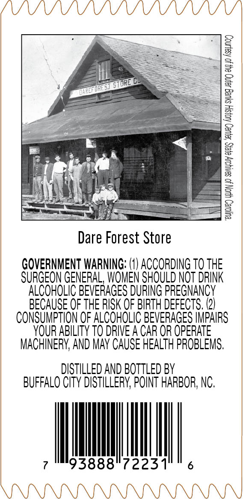
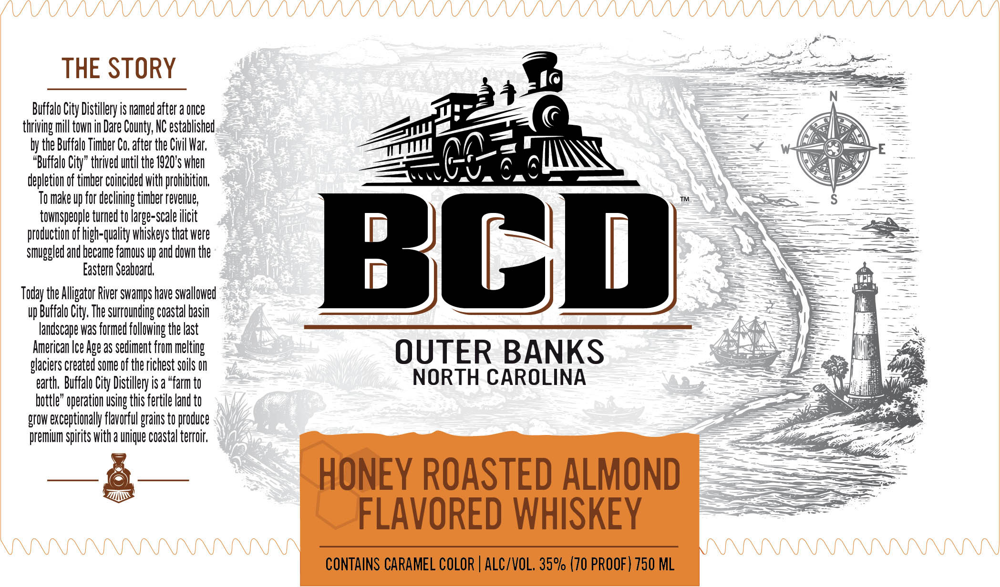
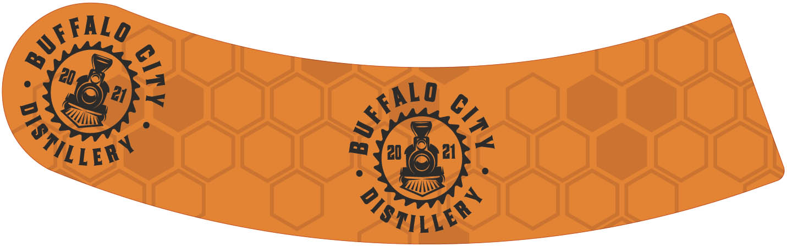

# TTB COLA Label Images - TTBID 26065001000275

**Brand Name:** BCD

**Issue Date:** 03/06/2026

**Origin Code:** 35

**Product Class/Type:** 149

**Source:** [TTB Public COLA Registry](https://ttbonline.gov/colasonline/viewColaDetails.do?action=publicFormDisplay&ttbid=26065001000275)

## Label Images

### Back Label

### Front Label

### Label 3

## Extracted Label Text

*Text extracted via OCR - may contain errors*

*1 image(s) excluded: text did not meet readability threshold*

**Detected Proof:** 140

### Back Label

J
8
[
8
8
1
1
Dare Forest Store
GOVERNMENT WARNING: (1) ACCORDING TO THE
SURGEON GENERAL, WOMEN SHOULD NOT DRINK
ALCOHOLIC BEVERAGES DURING PREGNANCY
BECAUSE OF THE RISK OF BIRTH DEFECTS, (2)
CONSUMPTION OF ALCOHOLIC BEVERAGES IMPAIRS
YOuR ABILITY TO dRIVE A CAR OR OpERATE
MACHINERY; AND May CAUSE HEALTH PROBLEMS;
DISTILLED AND BOTTLED BY
BUFFALO CITY DISTILLERV; POINT HARBOR; NC.
93888"7223-
store
ToRES
VdacF

### Front Label

THE STORY
Buffalo City Distillery is named after a Once
thriving mill towh in Dare County; NC established
by the Buffalo Timber Co, after the Civil War;
"Buffalo City" thrived until the 1920*s When
depletion of timber coincidedwith prohibition;
To make up for declining timber revenue;
townspeople turned to large-scale ilicit
Jghxnuelunwadnonur
Bod
Eastern Seaboard;,
Today the Alligator River swamps have swallowed
Vp Buffalo City; The surrownding coastal basin
landscape was formed following the last
American Ice Age 2S sediment from melting
OUTER BANKS
glaciers created some of the richest sils On
earth;  Buffalo City Distillery is a "farm to
NORTH CAROLINA
bottle" operation ISing this fertile land to
grOw exceptionally flavorful grains to produce
premium Spirits with a Wnique coastal terroir;
HONEY ROASTED ALMOND
FLAVORED WHISKEY
CONTAINS CARAMEL COLOR | ALC/VOL, 35% (70 PROOF) 750 ML
