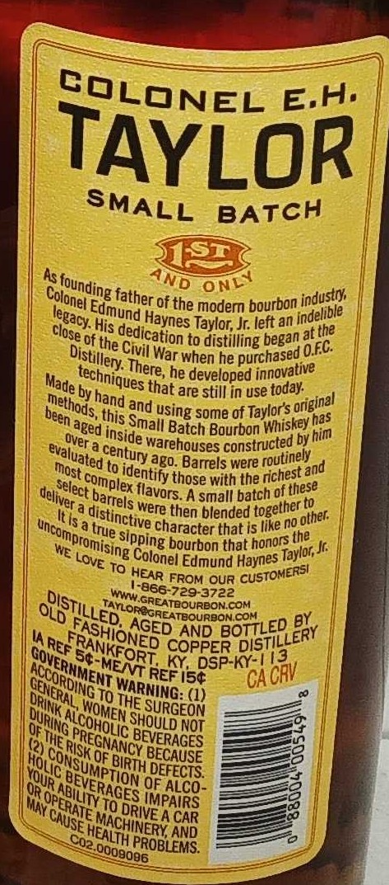
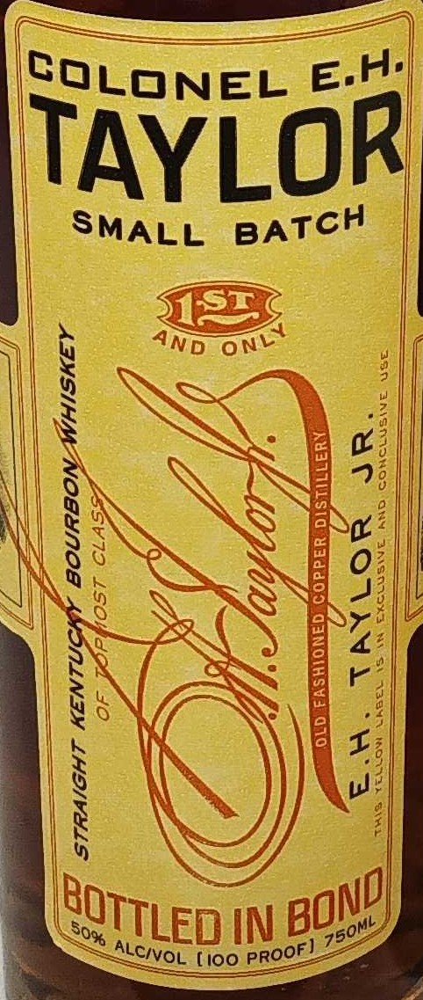
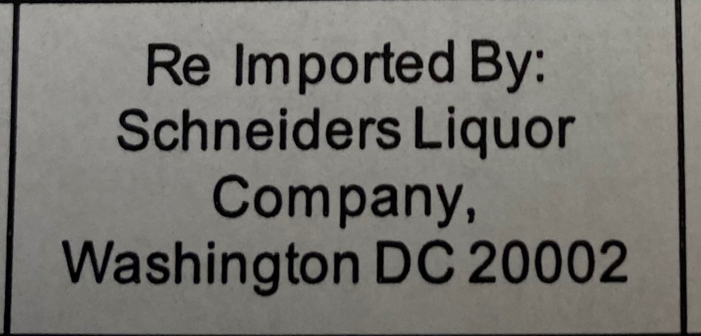

# TTB COLA Label Images - TTBID 26065001000281

**Brand Name:** COLONEL E.H. TAYLOR

**Fanciful Name:** SMALL BATCH

**Issue Date:** 03/12/2026

**Origin Code:** 00

**Product Class/Type:** 119

**Source:** [TTB Public COLA Registry](https://ttbonline.gov/colasonline/viewColaDetails.do?action=publicFormDisplay&ttbid=26065001000281)

## Label Images

### Back Label

### Front Label

### Label 3

## Extracted Label Text

*Text extracted via OCR - may contain errors*

*1 image(s) excluded: text did not meet readability threshold*

### Back Label

TAYLOR
BATCH
S1S1
As
the modern bourbon
His
Taylor; Jr left an
the
of the
to distilling began at5
War when he
he developed
by
that are still in use
this Snd using some of Taylors
has
Bourbon hiskeyhai
warehouses
by
to
ag0. Barrels were
and
with the
Assmall batch of these
were
blended
Itisa
character that i5 like no
the
WE
bourbon that
To
Edmund Haynes
FROM OUR
"866-729-3722
SREATOOURBONCOM
0lo
coM
BY
AND
Uaref
COPPER
Ky DSP-KY-((3
Acc
REF 154
"GA CRV
ToTHE
(1)
DUf
SURGEON
OF
NOT
25
OF
BECAUSE
DEFECTS
QoP
'9FP4cB
3
'To
A CAR
AND
COLONEL
E.h.
SMALL
And
ONLY
s founding S
Colonel =
father of'
industry
Edmund
legacy:
indelible
Haynes
dedication
close
Civil "
O.fc
Distillery
purchased
There,
innovative
techniques =
Made '
'today:
hand
 Original
~methods,
~been :
Small
aged
Batch
inside
~over =
constructed
~evaluated
century-
routinely
most e
 identify
'richest =
'those
complex '
~select
flavors:
~deliver -
barrels
(together
then
'distinctive =
} other:
uncompromising
true
:sipping
honors
Taylon; _
Colonel
LOvE
CUSTOMERsI
HEAR
W'
Distilled
TAYLOREOREATBOURBONS
FASHIONED
AGED
BOTTLED
DISTILLERY
EE8E5
GoveRHMENI
MeNT
LORDING
NOSRs88
WARNING:
ORINK
'WOMEN =
SHOULD
JRING _
3
PREGNANCY
BEVERAGES
RISK C
ConSuMPion
(Hotic
BIRTH
NOUR L
BEVERAGES
AbiLity
MMAy
PerAIE
RIVE
(CAUSE
MACHINERY
HEALTH
C02
PROBLEMS:
0009006

### Front Label

a —————
Se
SQLONEL =
|
TAYLOR
| SMALL BATCH
ee
>) | q ane one alte
| 5 Ss FEN 2
NS WEG, |)
ik SSS & 2:
AEN NESS
N83 SQ. LY BO?
KS SSNS
Ss Se NaN SS
EX AS EF
| 8oNVH SB
Na. @\\
aS )) Ne
RNS
Born en ny oN!
Coe STLED IN BU soe
j SLCIVOL fioo PROOE
