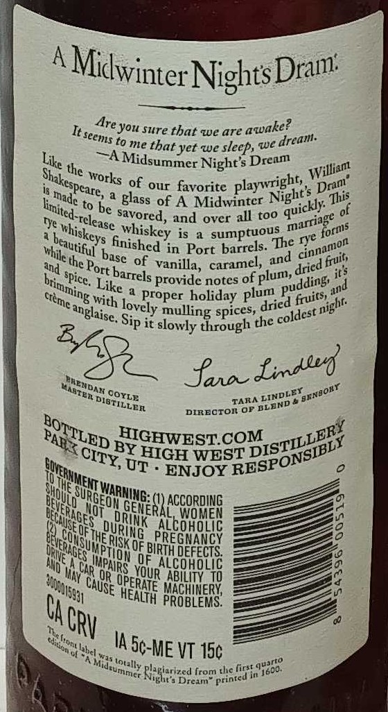
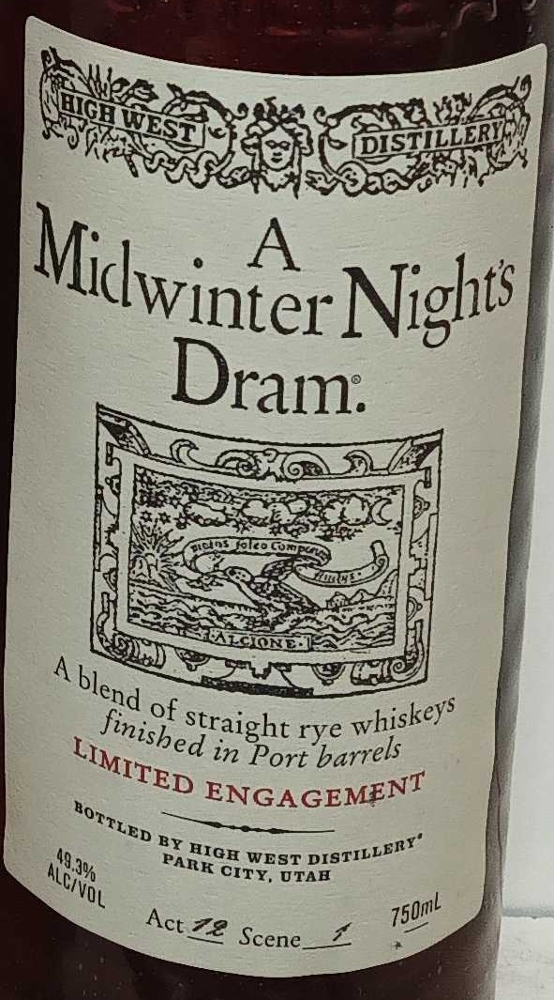

# TTB COLA Label Images - TTBID 26065001000296

**Brand Name:** HIGH WEST DISTILLERY

**Fanciful Name:** A MIDWINTER NIGHT'S DRAM

**Issue Date:** 03/13/2026

**Origin Code:** 00

**Product Class/Type:** 122

**Source:** [TTB Public COLA Registry](https://ttbonline.gov/colasonline/viewColaDetails.do?action=publicFormDisplay&ttbid=26065001000296)

## Label Images

### Back Label

### Front Label

### Label 3

## Extracted Label Text

*Text extracted via OCR - may contain errors*

*1 image(s) excluded: text did not meet readability threshold*

### Back Label

A
NightsDram:
sure that we are
to me that yet we slecp, we
Night $ Drenm
the works
of our favorite
to
glass of A
Midwintcr
This
be savored,
and
over all too
of
Tye
is
rye
in Port barrels: The
and€ the Port
of
vanilla, caramel,
jt}
provide notes of plum,
proper holiday plum
spices,
night
Sip it slowly through the
JaImaed
TAIA
DIRECTOI OF
BY
MIGHWEST CQM
HIGH WEST
UT
ENJOY
ACCORDING
E
Jjhe Risk
pueaxe
;
InFjok %
DEFECTS
Naoa on
Qun"HEAH6516
;
OPE
MACHINERY
PROBLEMS_
VGrv
IA
VT 15c
thc first
'Nistsid
Dreim
from
Midwinter:
Are you
awake?
It seems
dream
Like
Midsummer
William
Shakespcare;
playwright,,
Drn'
Night s
made
limited-=
quickly:
marriage
~rclease
~forms
: whiskcys
whiskey
sumptuous
beautiful
finished
cinnamon
while -
basc
and
Ifruit,
dried =
barrels
spice .
brimming `
pudding,
Like
and
~creme
fruits;
with
dried
lovely
anglaise.
mulling
coldest =
Raewdal
Laatea
BENBORT
LINDLEY
coyLE
'DIETILLEn
~DLAND=
BOTTLED
DISTILLERY
PARX "
RESPONSIBLY
CITY,
eEOAHHGH4AC
DRMK
DURING
BIRTHL
MPAiRs
YOUR
300001s931
'CAUSE
ERATE
HEALTH
5c-ME '
aen <
'ont label _
418
qujrto
Mideummcf
Iotilly -
1600.
Printed in _

### Front Label

44-
A
Nights
of
straight rye
in Port
ENGAGEMENT
BY
49
WEST
Jv
OTAB
Z2 Scene
HQE
VEsT~
DISTILLEBY
Midwinter
Dram:
blend
whiskeys
finisbed
LIMITED
barrels
BOTTLED
DISTILLERY'
HICH
PARK
Alcivol
CITY,
750mL
Act
