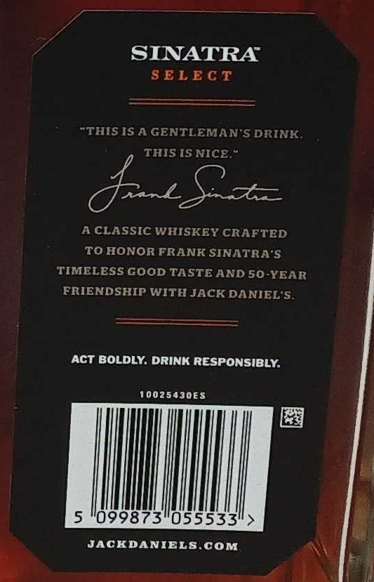
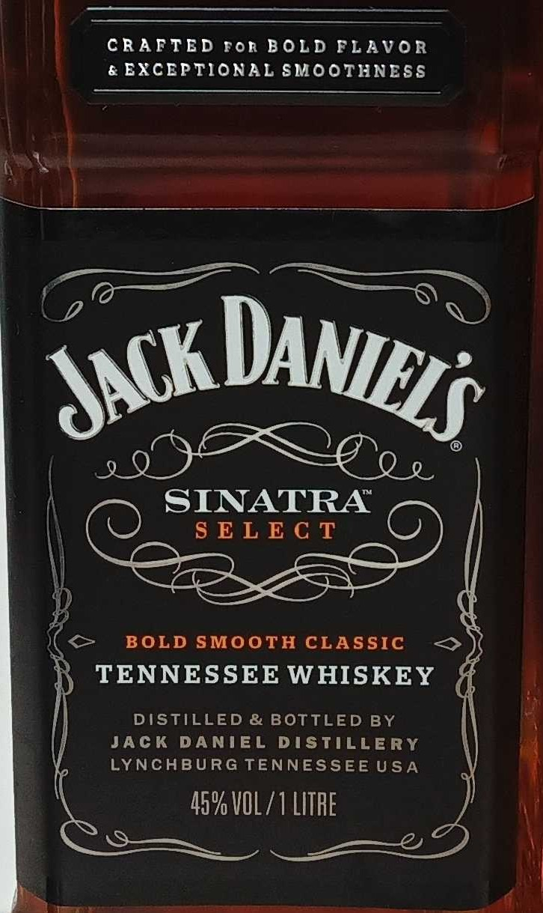
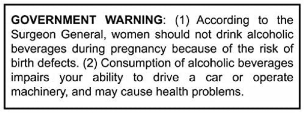

# TTB COLA Label Images - TTBID 26065001000302

**Brand Name:** JACK DANIEL'S

**Fanciful Name:** SINATRA SELECT

**Issue Date:** 03/12/2026

**Origin Code:** 00

**Product Class/Type:** 140

**Source:** [TTB Public COLA Registry](https://ttbonline.gov/colasonline/viewColaDetails.do?action=publicFormDisplay&ttbid=26065001000302)

## Label Images

### Back Label

### Front Label

### Label 3

### Label 4

## Extracted Label Text

*Text extracted via OCR - may contain errors*

*1 image(s) excluded: text did not meet readability threshold*

### Back Label

SINATRA
SELECT
"THIS IS A GENTLEMAN"S DRINK
THIS IS NICE.
4
A CLASSIC WHISKEY CRAFTED
TO HONOR FRANK SINATRA 5
TIMELESS GOOD TASTE AND 50-YEAR
FRIENDSHIP WITH JACK DANIEL'$.
AcT BOLDLY. DRINK RESPONsIBLY:
100254J0E$
5
099873"0555331
JACKDANIELS COM

### Front Label

CRAFTED ror BOLD FLAVOR
& EXCEPTIONAL SMOOTHNESS

<— BOLD SMOOTH CLASSIC <>
TENNESSEE WHISKEY
DISTILLED & BOTTLED BY

JACK DANIEL DISTILLERY
LYNCHBURG TENNESSEEUSA

45% VOL/1 LITRE

### Label 4

GOVERNMENT
WARNING:   (1) According
to
the
Surgeon General,
women should not drink alcoholic
beverages during pregnancy because of the risk of
birth defects. (2) Consumption of alcoholic beverages
impairs
your
ability
to
drive
car
Or
operate
machinery; and
cause health problems
may
