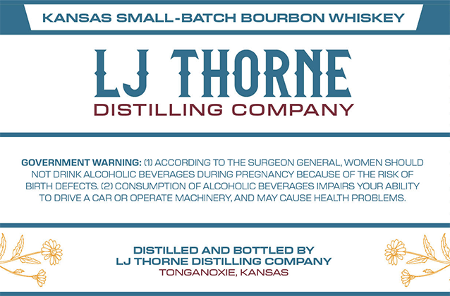
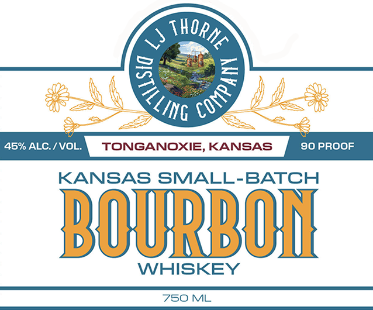

# TTB COLA Label Images - TTBID 26065001000410

**Brand Name:** LJ THORNE DISTILLING COMPANY

**Issue Date:** 03/16/2026

**Origin Code:** 21

**Product Class/Type:** 141

**Source:** [TTB Public COLA Registry](https://ttbonline.gov/colasonline/viewColaDetails.do?action=publicFormDisplay&ttbid=26065001000410)

## Label Images

### Back Label

### Front Label

## Extracted Label Text

*Text extracted via OCR - may contain errors*

### Back Label

KANSAS SMALL-BATCH BOURBON WHISKEY
LJ THORNE
DISTILLING COMPANY
GOVERNMENT WARNING: (1) ACCORDING TO THE SURGEON GENERAL; WOMEN SHOULD
NOT DRINK ALCOHOLIC BEVERAGES DURING PREGNANCY BECAUSE OF THE RISK OF
BIRTH DEFECTS (2) CONSUMPTION OF ALCOHOLIC BEVERAGES IMPAIRS YOUR ABILITY
TO ORIVE
CAR OR OPERATE MACHINERY,AND MAY CAUSE HEALTH PROBLEMS_
DISTILLED AND BOTTLED BY
LJTHORNE DISTILLING COMPANY
TONGANOXIE, KANSAS

### Front Label

GZ

SS

NG

45% REI TONGANOXIE, KANSAS | 20 PROOF

KANSAS SMALL-BATCH

BOURBON

WHISKEY

750 ML
