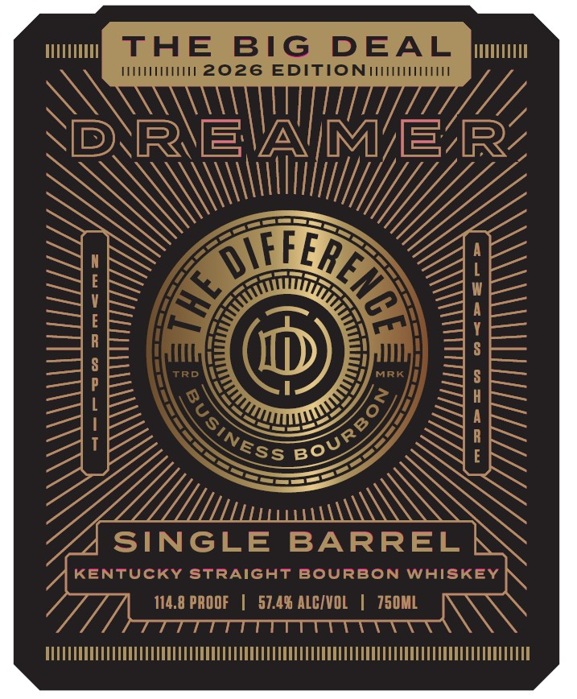
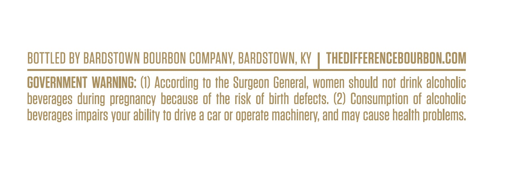
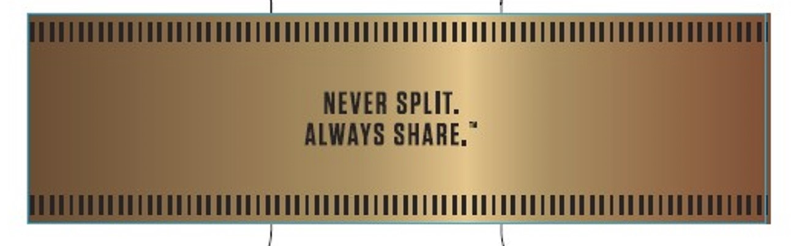

# TTB COLA Label Images - TTBID 26065001000415

**Brand Name:** THE DIFFERENCE

**Issue Date:** 03/12/2026

**Origin Code:** 22

**Product Class/Type:** 101

**Source:** [TTB Public COLA Registry](https://ttbonline.gov/colasonline/viewColaDetails.do?action=publicFormDisplay&ttbid=26065001000415)

## Label Images

### Label 1

### Label 2

### Label 3

## Extracted Label Text

*Text extracted via OCR - may contain errors*

*1 image(s) excluded: text did not meet readability threshold*

**Detected Proof:** 114.8

### Label 1

ThE
BIG
DEAL
M2026 EDITIONIH
RIEAMMER
1
R
1
TRD
MRK
;
1
T
SINGLE BARREL
KEnTUCKY StRAiGHT BOURBON Whiskey
114.8 PROOF
57.4% ALCIVOL
750ML
HTT
@LFL
A
BoURBO
'SINESS

### Label 2

BOTTLED BV BARDSTOWN BOURBON COMPANY, BARDSTOWN; KY
THEDIFFERENCEBOURBONCOM
GOVERNMENT  WARNING: (1) According to the Surgeon General; women should not drink alcoholic
beverages during pregnancv because of the risk of birth defects. (2) Consumption of alcoholic
beverages impairs vour ability to drive a car or operate machinery; and
cause health problems;
may
