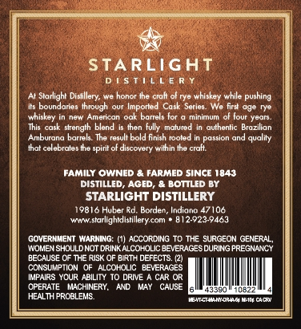
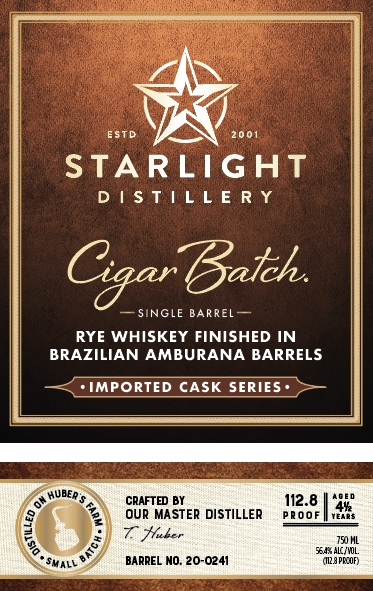

# TTB COLA Label Images - TTBID 26065001000442

**Brand Name:** STARLIGHT DISTILLERY

**Fanciful Name:** CIGAR BATCH

**Issue Date:** 03/09/2026

**Origin Code:** 19

**Product Class/Type:** 142

**Source:** [TTB Public COLA Registry](https://ttbonline.gov/colasonline/viewColaDetails.do?action=publicFormDisplay&ttbid=26065001000442)

## Label Images

### Back Label

### Front Label

## Extracted Label Text

*Text extracted via OCR - may contain errors*

### Back Label

STARLIGAT
D ! $ T!L L E R
Starlight Dislillery; we
ener
Ihe cralt of rye whiskey while pushing
omundaner
Ihrough
Imporled Cask Seriea. We firdt age rye
whiskey
Amentan
oak barrels for
minlmum of four Year
This cask strength blend
then fully malured
authentic Brazilian
Amburung
barrels The result bold finish tooled
Dossion
qualit
Ihat celebrale
spirit of discovery wilhin the craht
Tamily OWNED
FARMED SINCE 1843
DISTILLED
AGED
BOTTLED BY
STARLIGHT DISTILLERY
19816 Huber Rd: Borden, Indiano 47106
Www starlighidistillery com
812923-9463
GOVERNMENT MARNING:
ACCORCING TO THE SURGEON GENERAL,
MOMEN SHOULDNOT DRINKALCOHOLIC BEVERAGESDURING PREGNANCY
BECAUSE CF THE RISK OF BiRTH DEFECTS (21
CONSLIPTION
ALCOHOLIC BEYERAGES
IMPAIRS YOUR ABILITY 10 DRIVE
CAR OR
OPERATE
MACHINERY,
AND
CAUSE
43390
HEALTH PRCBLEM8
JnHctimaenient Cla

### Front Label

Va \os

ESTD

_ =

2001

STARLIGHT

DISTILLERY

Bath,

— SINGLE BARREL —

RYE WHISKEY FINISHED IN

BRAZII

JAN AMBURANA BARRELS

—<(: IMPORTED CASK SERIES» >—

RUBER

CRAFTED BY

12.8

sven

OOF

vest

‘45

r

OUR MASTER DISTILLER

cee

7

ae

70H

(4

<

Semacim

ns

Sune

)

‘aap

ARIEL NO, 20-024
