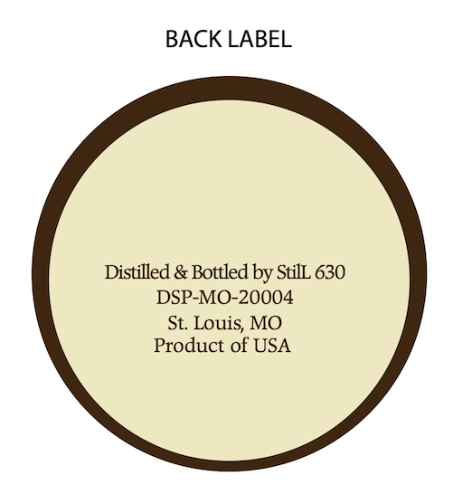

# TTB COLA Label Images - TTBID 26065001000479

**Brand Name:** STILL 630 MISSOURI STRAIGHT BOURBON WHISKEY - BOTTLED-IN-BOND

**Issue Date:** 03/13/2026

**Origin Code:** 29

**Product Class/Type:** 101

**Source:** [TTB Public COLA Registry](https://ttbonline.gov/colasonline/viewColaDetails.do?action=publicFormDisplay&ttbid=26065001000479)

## Label Images

### Back Label

### Front Label

### Label 1

### Label 3

## Extracted Label Text

*Text extracted via OCR - may contain errors*

*2 image(s) excluded: text did not meet readability threshold*

**Detected Proof:** 100

### Back Label

BACK LABEL

Distilled & Bottled by StilL 630

DSP-MO-20004

St. Louis, MO

Product of USA

### Label 1

GOVERNMENT WARNING: (I) AccOrding TO THE
IEPOI
StilL 630
SURGEON  GENERAL, WOMEN  SHOULD NOT  DRINK
Alcoholc
BEVERAGES
DURING
PREGNANCY
Kizramt
2
Missouri Straight Bourbon Whiskey
because  OF THE  RISK  OF   BIRTH  defects.
acttal real UPC
II |
scan for tasty
CONSUMPTHON OF ALcOHOLC  BEVERAGES IpARIS
8dem423k107
drink recipes:
'Il"
Bottled-In-Bond
YOUR   AbILy  TO   DRIVE A CAR   OR   OpERATE
8
52661" 81755'
100 Proof) 50% AlcNVol 750ml
still630.com
MAchINeRV; AND MAY CAUSE HEALTH PROBLEMS.
WR
dtop;
