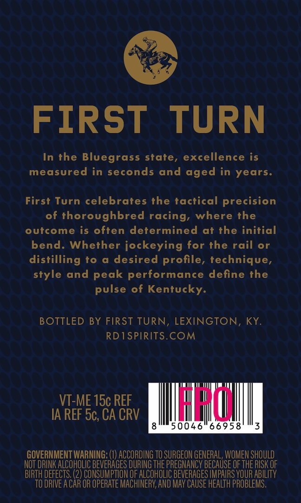

# TTB COLA Label Images - TTBID 26065001000527

**Brand Name:** RD ONE

**Issue Date:** 03/09/2026

**Origin Code:** 22

**Product Class/Type:** 101

**Source:** [TTB Public COLA Registry](https://ttbonline.gov/colasonline/viewColaDetails.do?action=publicFormDisplay&ttbid=26065001000527)

## Label Images

### Back Label

## Extracted Label Text

*Text extracted via OCR - may contain errors*

### Back Label

FIRST
TURN
In the Bluegrass state, excellence is
measured in seconds and
in years.
First Turn celebrates the tactical precision
of thoroughbred racing, where the
outcome is often determined
at the initial
bend. Whether jockeying for the rail or
distilling to
desired profile, technique,
and peak performance define the
pulse of Kentucky
BOTTLED BY FIRST TURN, LEXINGTON, KY
RDISPIRITS.COM
VT-ME 15c REF
ILhuL
IA REF 5c, CA CRV
50046
66958
GOVERNMENT WARNING: (1) ACCORDING TO SURGEON GENERAL, WOMEN SHOULD
NoT DRINK ALCOHOLIC BEVERAGES DURING THE PREGNANCY BECAUSE OF THE RISK OF
BIRTH DEFECTS; (2) CONSUMPTION OF ALCOHOLIC BEVERAGES IMPAIRS VOUR ABILITY
TO DRIVE A CAR OR OPERATE MACHINERY; AND May CAUSE HEALTH PROBLEMS,
aged
style
