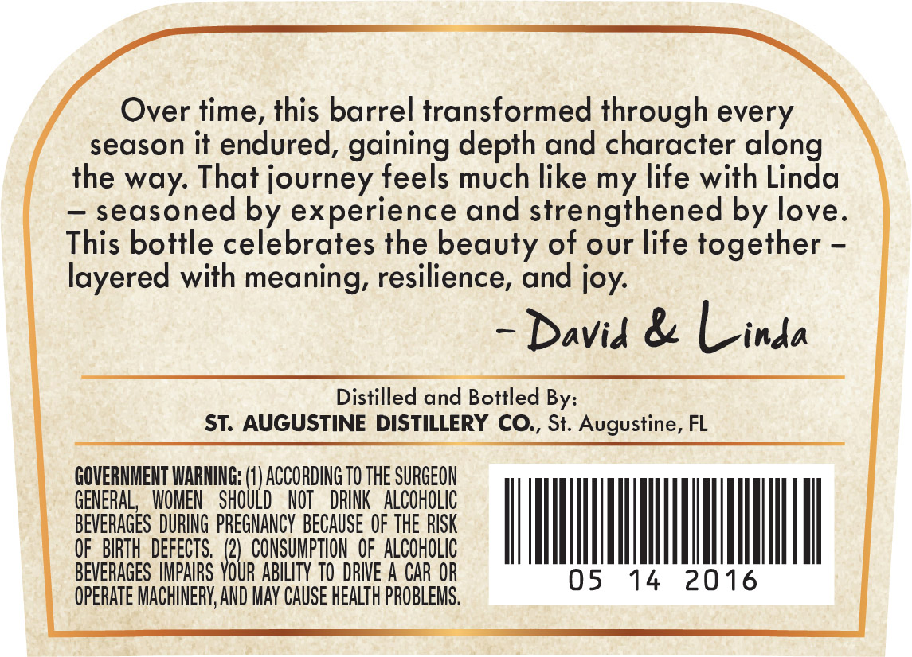
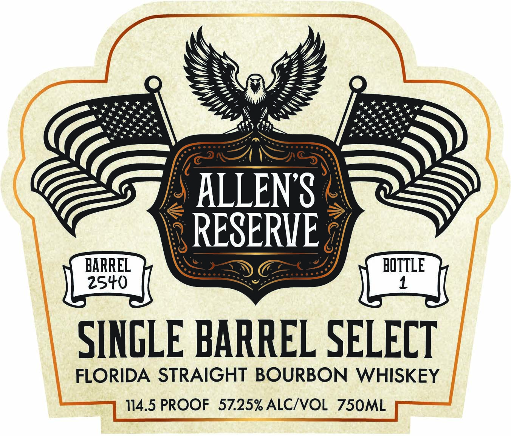
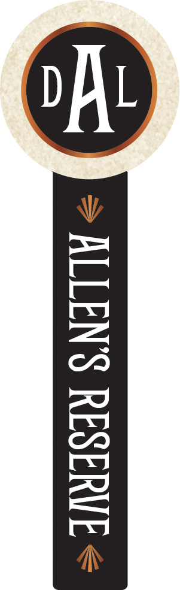

# TTB COLA Label Images - TTBID 26065001000538

**Brand Name:** ALLEN'S RESERVE

**Fanciful Name:** SINGLE BARREL SELECT

**Issue Date:** 04/03/2026

**Origin Code:** 16

**Product Class/Type:** 101

**Source:** [TTB Public COLA Registry](https://ttbonline.gov/colasonline/viewColaDetails.do?action=publicFormDisplay&ttbid=26065001000538)

## Label Images

### Back Label

### Front Label

### Label 3

## Extracted Label Text

*Text extracted via OCR - may contain errors*

*1 image(s) excluded: text did not meet readability threshold*

**Detected Proof:** 114.5

### Back Label

Over time, this barrel transformed through every
season it endured, gaining depth and character along
the way: That journey feels much like my life with Linda
seasoned by experience and strengthened by love.
This bottle celebrates the beauty of our life together
layered with meaning, resilience, and joy:
Davia & Linda
Distilled and Bottled By:
ST: AUGUSTINE DISTILLERY CO:, St. Augustine, FL
GOVERNMENT WARNING; (0) ACCORDING TO THE SURGEON
GENERAL  WOMEN
SHOULD
NOT   DRINK   ALCOHOLIc
BEVERAGES DURING PREGNANCY  BECAUSE OF THE RISK
OF   BIRTH  DEFECTS.
CONSUMPTION  OF  ALCOHOLIC
BEVERAGES IMPAIRS
YbUR
ABILITY TO  DRIVE A CAR OR
05
14
2016
OpeRATE MACHINERY,AND MAY CAuSe HEALTh PROBLEMS ,

### Front Label

ALLENS
RESERHE
BARREL
BOTTLE
25+0
1
SINGLE BARREL SELECT
FLORIDA STRAIGHT BOURBON WHISKEY
114.5 PROOF
57.25% ALCIVOL
75OML
