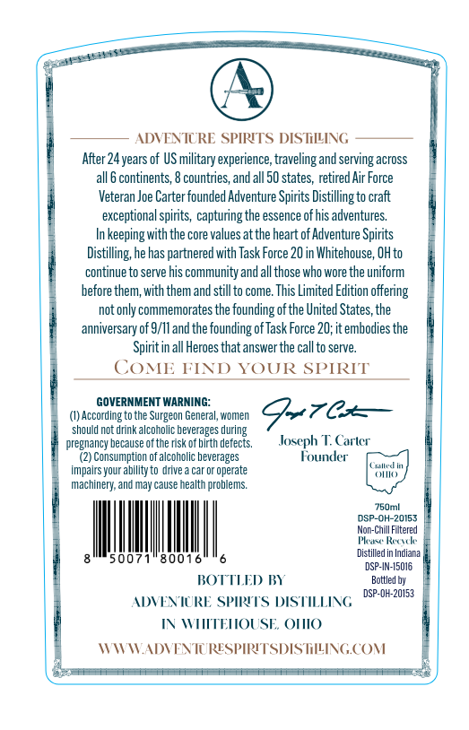
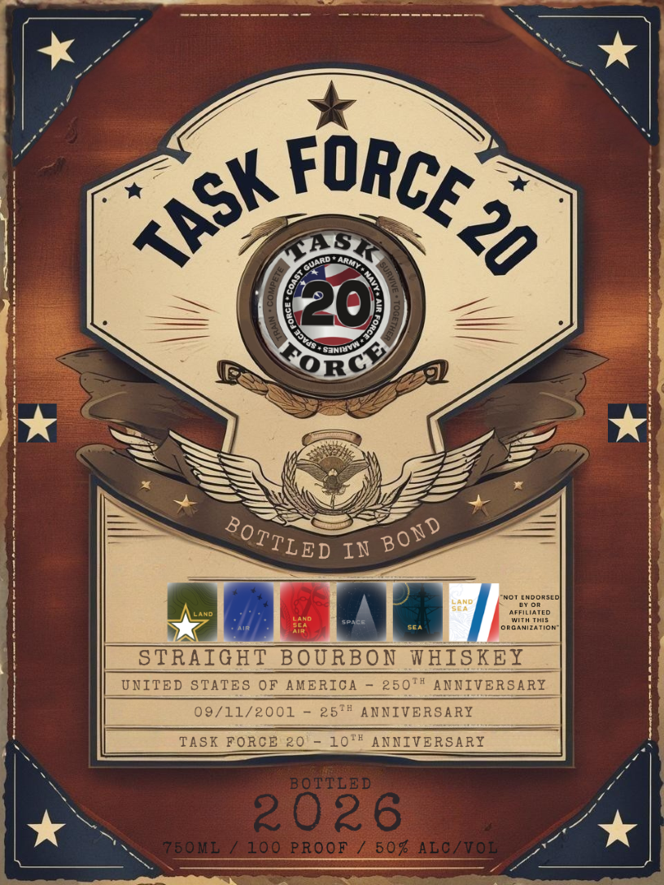

# TTB COLA Label Images - TTBID 26065001000604

**Brand Name:** TASK FORCE 20

**Issue Date:** 04/22/2026

**Origin Code:** 09

**Product Class/Type:** 119

**Source:** [TTB Public COLA Registry](https://ttbonline.gov/colasonline/viewColaDetails.do?action=publicFormDisplay&ttbid=26065001000604)

## Label Images

### Back Label

### Front Label

## Extracted Label Text

*Text extracted via OCR - may contain errors*

**Detected Proof:** 100
**Detected Age:** 24 Years

### Back Label

ADVENTCRE SPIRITS DIS TLLING
After 24years of US military experience, traveling and serving across
continents; 8 countries, and all 50 states, retired Air Force
Veteran Joe Carter founded Adventure Spirits Distilling to craft
exceptional spirits , capturing the essence of his adventures.
keeping with the core values at the heart of Adventure Spirits
Distilling; he has partnered with Task Force 20 in Whitehouse; OHto
continue to serve his community andallthose who wore the uniform
before them, with them and stillto come. This Limited Edition -
offering
not only commemorates the founding ofthe United States,the
anniversary of 9/11 and the founding ofTask Force 20;it embodies the
Spirit in all Heroes that answer the call to serve_
CoME FIND
YOUR SPIRIT
GOVERNMENT WARNING:
According to the Surgeon General
Women
Qzen
should not drink alcoholic beverages during
pregnancy because ofthe risk of birth defects
Joseph T. Carlcr
(2) Consumption of alcoholic beverages
Founder
Ul n
impairs your ability to drive a car
operate
(
machinery; and may cause health problems:
750ml
DSP-OH-20153
Chill Filtered
Pla Ruk
5007
8001
Distilled in Indiana
DSP-IN-|5016
BOTTLED) BY
Bottled E
DSP-OH-20153
ADIEN IRE SPIRITS DISTILLING
IN WTEHOUSE OHIO
WTWADVENTURESPIRITSDIS HILING COM

### Front Label

4437
Guand
20
In
LMDORSLC
ada
^feiATFc
Witu ThIs
Oncaaol
STRAIGHT BOURBON WHISKEY
UNITED STATES OF AMERICA
250t# ANNIVERSARY
09/11/2001
25*4 ANNIVERSARY
TASK FORCE 20
10" ANNIVERSARY
BOTTLED
2026
750 NL
100
PROOF
50% ALC /VOL
FORCE ,
TASK
20
8
Q0ECe
BOTTLED
BOND
