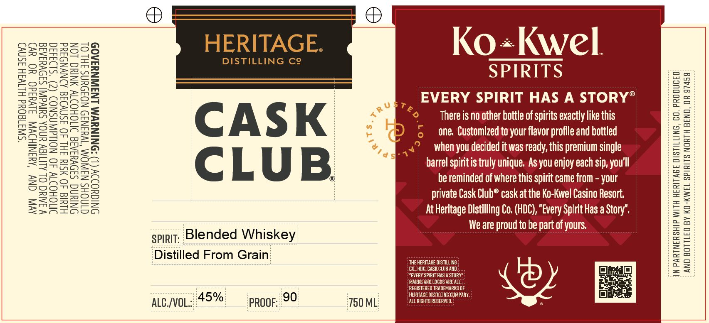

# TTB COLA Label Images - TTBID 26065001000643

**Brand Name:** HERITAGE DISTILLING CO. CASK CLUB

**Issue Date:** 03/09/2026

**Origin Code:** 38

**Product Class/Type:** 137

**Source:** [TTB Public COLA Registry](https://ttbonline.gov/colasonline/viewColaDetails.do?action=publicFormDisplay&ttbid=26065001000643)

## Label Images

### Back Label

## Extracted Label Text

*Text extracted via OCR - may contain errors*

### Back Label

“SW3180Ud HLIVSH ASNV)

AVIN ONY ‘AMSNIHOW J1Vuad0 YO ev)
VIAN OL ALIIAY UNOA SHIVA SADVYIAIE

INOHOIW 40 NOLdWASNOD (2) °S193430
HIMIG 40 SIU IHL 40 ISMVIIG AINYNDIYd

ONIUNG SIOVYIAIG INOHOIV ANIUG LON
DNIGYODIV (L) “SNINUWM LNIWNYIAO9

CINOHS NAWOM “TWa3N49 NOIOUNS JHL OL

HERITAGE. Ko«+Kwel.

DISTILLING Ce es

SPIRITS
EVERY SPIRIT HAS A STORY°®

PT
C A S K © Thereis no other bottle of sprts exactly like this
5 one, Customized to your flavor profile and bottled
‘ ar when you decided it was ready, this premium single
Cc L U B barrel spirit is truly unique. As you enjoy each sip, you'll
( be reminded of where this spirit came from - your
private Cask Club® cask at the Ko-Kwel Casino Resort,

AtHeritage Distilling Co. (HDC), “Every Spirit Has a Story’.
We are proud to be part of yours,

Distilled From Grain

IN PARTNERSHIP WITH HERITAGE DISTILLING, CO. PRODUCED
AND BOTTLED BY KO-KWEL SPIRITS NORTH BEND, OR 97459

IF
HERITAGE MISTILLING COMPANY.

Auc/voL: 427 poor: 99 ie coe
