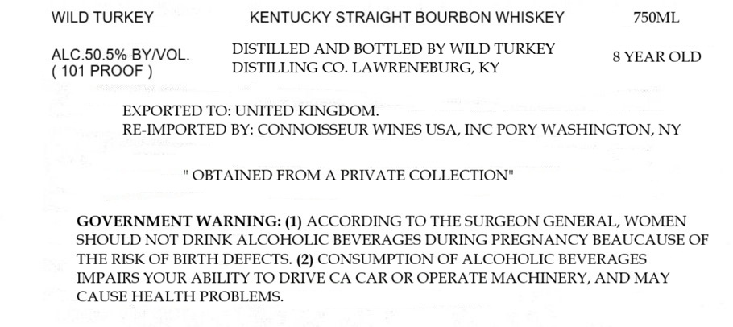

# TTB COLA Label Images - TTBID 26065001000736

**Brand Name:** WILD TURKEY

**Fanciful Name:** 8 YEARS OLD

**Issue Date:** 03/09/2026

**Origin Code:** 00

**Product Class/Type:** 101

**Source:** [TTB Public COLA Registry](https://ttbonline.gov/colasonline/viewColaDetails.do?action=publicFormDisplay&ttbid=26065001000736)

## Label Images

### Label 1

## Extracted Label Text

*Text extracted via OCR - may contain errors*

**Detected Proof:** 101

### Label 1

WILD TURKEY
KENTUCKY STRAIGHT BOURBON WHISKEY
750ML
ALC.50.5% BYNOL
DISTILLED AND BOTTLED BY WILD TURKEY
YEAR OLD
101 PROOF
DISTILLING CO. LAWRENEBURG, KY
EXPORTED TO: UNITED KINGDOM
RE-IMPORTED BY: CONNOISSEUR WINES USA, INC PORY WASHINGTON, NY
OBTAINED FROM A PRIVATE COLLECTION"
GOVERNMENT WARNING: (1) ACCORDING TO THE SURGEON GENERAL, WOMEN
SHOULD NOT DRINK ALCOHOLIC BEVERAGES DURING PREGNANCY BEAUCAUSE OF
THE RISK OF BIRTH DEFECTS. (2) CONSUMPTION OF ALCOHOLIC BEVERAGES
IMPAIRS YOUR ABILITY TO DRIVE CA CAR OR OPERATE MACHINERY, AND MAY
CAUSE HEALTH PROBLEMS_
