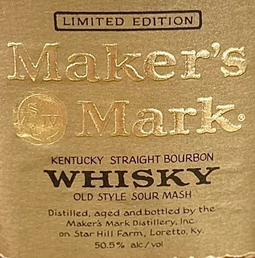

# TTB COLA Label Images - TTBID 26065001000771

**Brand Name:** MAKER'S MARK

**Fanciful Name:** GOLD LABEL

**Issue Date:** 03/10/2026

**Origin Code:** 00

**Product Class/Type:** 101

**Source:** [TTB Public COLA Registry](https://ttbonline.gov/colasonline/viewColaDetails.do?action=publicFormDisplay&ttbid=26065001000771)

## Label Images

### Label 1

## Extracted Label Text

*Text extracted via OCR - may contain errors*

**Detected Proof:** 101

### Label 1

LIMITED EDITION
Makers
Mark
KENTUCKY STRAIGHT BOURBON
WHISKY
OLD STYLE SOUR MASH
Distilled, aged and bottled by the
Makers Mark Distillery Inc
on Star Hill Farm
Loretto
Ky-
50.5 %
alc / vol
