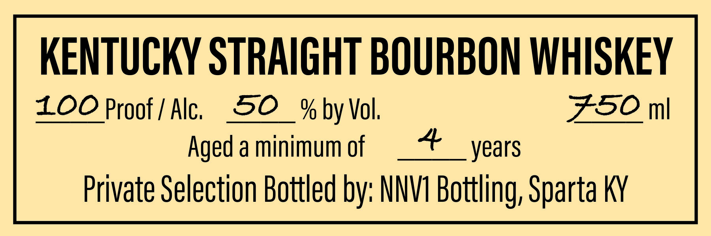
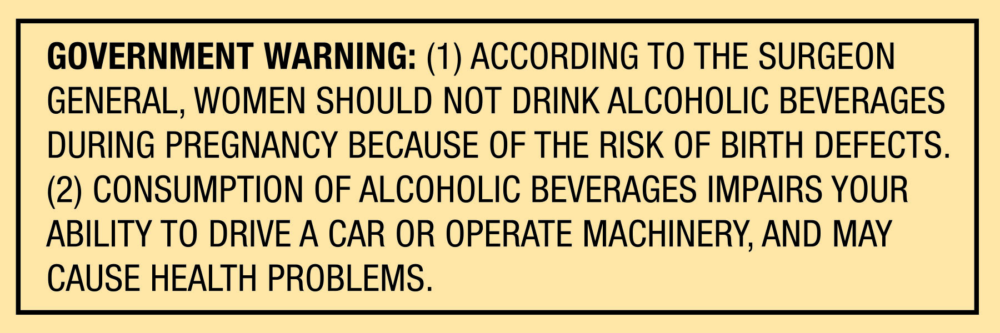

# TTB COLA Label Images - TTBID 26065001000826

**Brand Name:** NNV1

**Issue Date:** 03/10/2026

**Origin Code:** 22

**Product Class/Type:** 101

**Source:** [TTB Public COLA Registry](https://ttbonline.gov/colasonline/viewColaDetails.do?action=publicFormDisplay&ttbid=26065001000826)

## Label Images

### Label 1

### Label 2

## Extracted Label Text

*Text extracted via OCR - may contain errors*

**Detected Age:** 4 Years

### Label 1

KENTUCKY STRAIGHT BOURBON WHISKEY
LOQ Proof
Alc;
50
% by Vol;
Z5ml
Aged a minimum of
4
years
Private Selection Bottled by: NNVI Bottling; Sparta KY

### Label 2

GOVERNMENT WARNING: (1) ACCORDING TO THE SURGEON

GENERAL, WOMEN SHOULD NOT DRINK ALCOHOLIC BEVERAGES

DURING PREGNANCY BECAUSE OF THE RISK OF BIRTH DEFECTS

(2) CONSUMPTION OF ALCOHOLIC BEVERAGES IMPAIRS YOUR

ABILITY TO DRIVE A CAR OR OPERATE MACHINERY, AND MAY

CAUSE HEALTH PROBLEMS.
