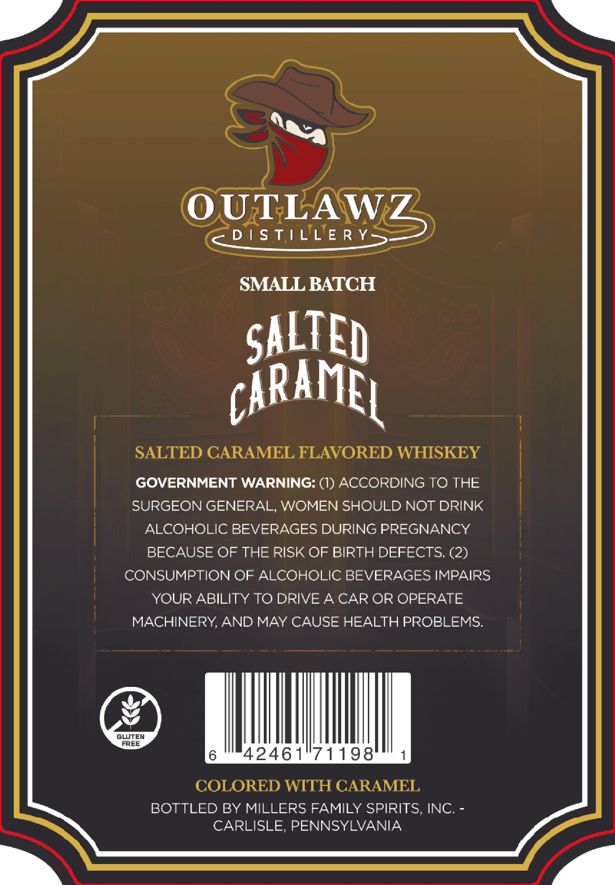
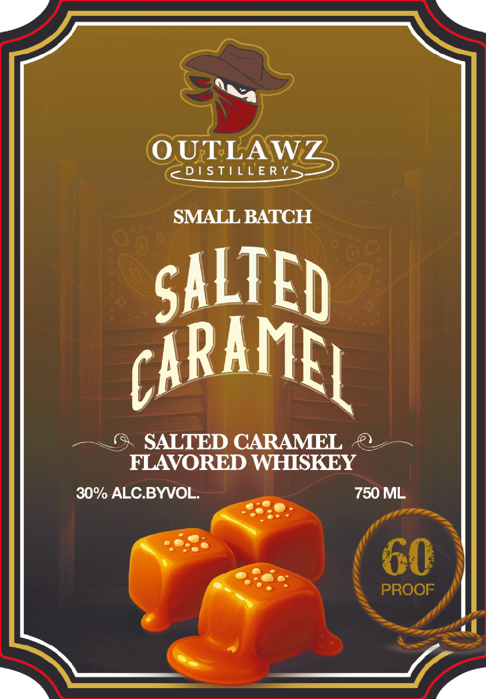

# TTB COLA Label Images - TTBID 26066001000039

**Brand Name:** OUTLAWZ DISTILLERY

**Issue Date:** 03/10/2026

**Origin Code:** 39

**Product Class/Type:** 149

**Source:** [TTB Public COLA Registry](https://ttbonline.gov/colasonline/viewColaDetails.do?action=publicFormDisplay&ttbid=26066001000039)

## Label Images

### Back Label

### Front Label

## Extracted Label Text

*Text extracted via OCR - may contain errors*

**Detected Proof:** 60

### Back Label

OUTLAWZ
D / S TLLE R Y
SMALL BATCH
SALTED
caramEL
SALTED CARAMEL FLAVORED WHISKEY
GOVERNMENT WARNING: (1) ACCORDING TO THE
SURGEON GENERAL, WOMEN SHOULD NOT DRINK
ALCOHOLIC BEVERAGES DURING PREGNANCY
BECAUSE OF THE RISK OF BIRTH DEFECTS; (2)
CONSUMPTION OF ALCOHOLIC BEVERAGES IMPAIRS
YOUR ABILITY TO DRIVEA CAR OR OPERATE
MACHINERY AND MAY CAUSE HEALTH PROBLEMS:
GLUTEN
FREE
42461"71198
COLORED WITH CARAMEL
BOTTLED BY MILLERS FAMILY SPIRITS; INC.
CARLISLE, PENNSYLVANIA

### Front Label

OUTLAWZ
D / S TILLE R Y
SMALL BATCH
SALTED
GARAML
SALTED CARAMEL
FLAVORED WHISKEY
30% ALCBYVOL
750 ML
60
PROOF
