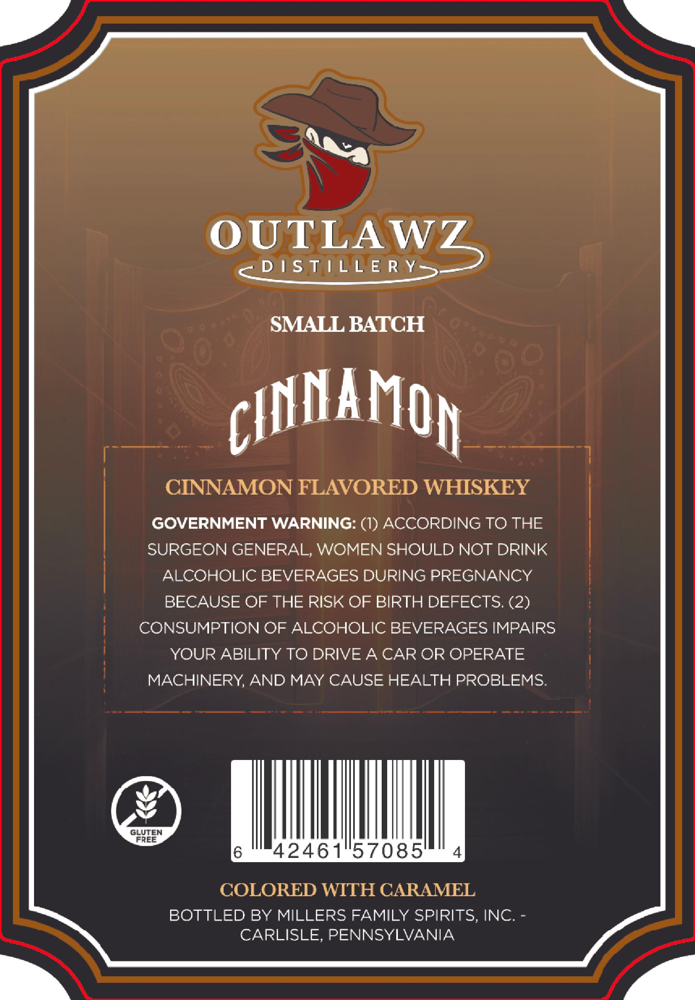
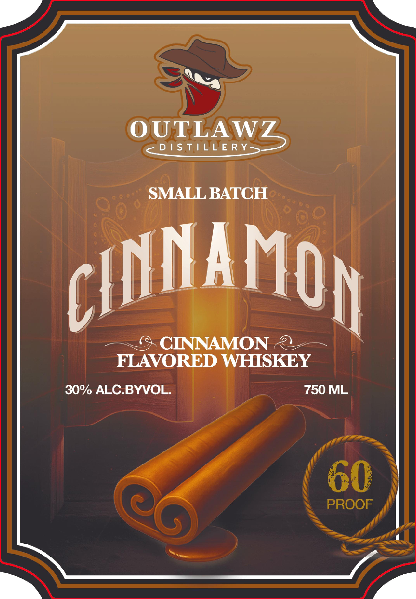

# TTB COLA Label Images - TTBID 26066001000045

**Brand Name:** OUTLAWZ DISTILLERY

**Issue Date:** 03/09/2026

**Origin Code:** 39

**Product Class/Type:** 149

**Source:** [TTB Public COLA Registry](https://ttbonline.gov/colasonline/viewColaDetails.do?action=publicFormDisplay&ttbid=26066001000045)

## Label Images

### Back Label

### Front Label

## Extracted Label Text

*Text extracted via OCR - may contain errors*

### Back Label

OUTLAWZ
D 1S T 1LL E R Y_
SMALL BATCH
cIMAMOh
CINNAMON FLAVORED WHISKEY
GOVERNMENT WARNING: (1) ACCORDING TO THE
SURGEON GENERAL, WOMEN SHOULD NOT DRINK
ALCOHOLIC BEVERAGES DURING PREGNANCY
BECAUSE OF THE RISK OF BIRTH DEFECTS. (2)
CONSUMPTION OF ALCOHOLIC BEVERAGES IMPAIRS
YOUR ABILITY TO DRIVE A CAR OR OPERATE
MACHINERY AND MAY CAUSE HEALTH PROBLEMS
GLUTEN
FREE
42461"57085'
COLORED WITH CARAMEL
BOTTLED BY MILLERS FAMILY SPIRITS, INC.
CARLISLE, PENNSYLVANIA

### Front Label

OUTLAWZ
D /S TLLE Ry=
SMALL BATCH
cIUaMOh
CINNAMON
FLAVORED WHISKEY
30%/ ALC BYVOL
750 ML
6O
PROOF
