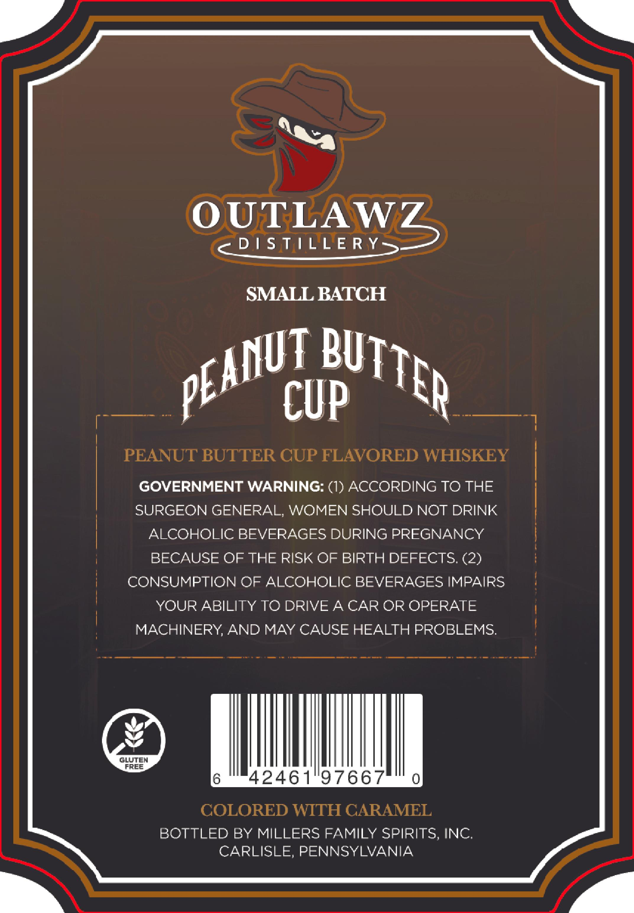
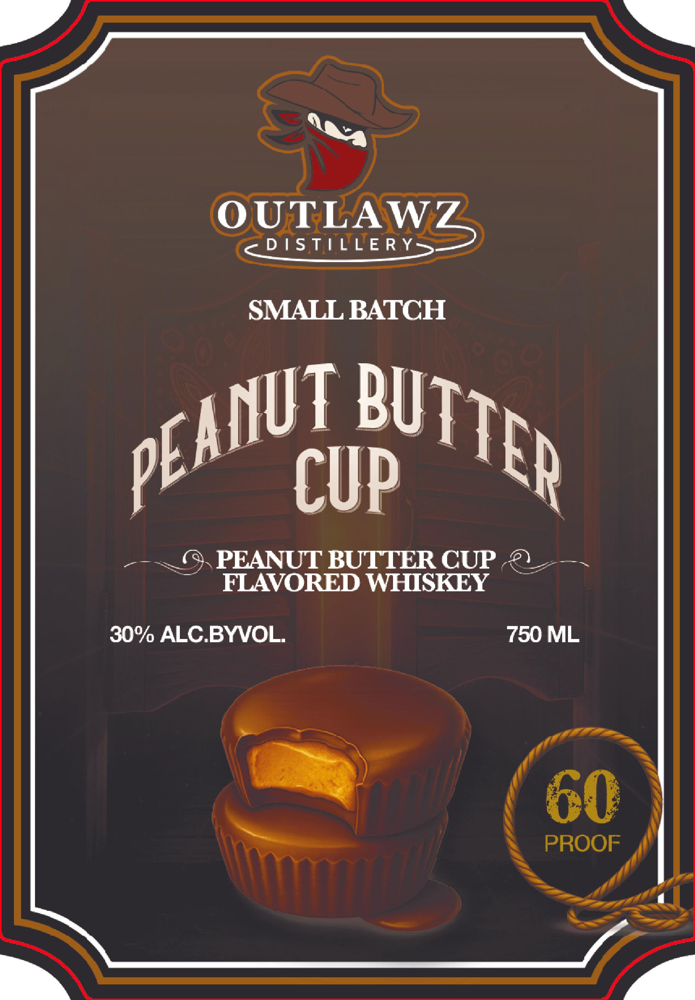

# TTB COLA Label Images - TTBID 26066001000047

**Brand Name:** OUTLAWZ DISTILLERY

**Fanciful Name:** PEANUT BUTTER CUP WHISKEY

**Issue Date:** 03/26/2026

**Origin Code:** 39

**Product Class/Type:** 149

**Source:** [TTB Public COLA Registry](https://ttbonline.gov/colasonline/viewColaDetails.do?action=publicFormDisplay&ttbid=26066001000047)

## Label Images

### Back Label

### Front Label

## Extracted Label Text

*Text extracted via OCR - may contain errors*

**Detected Proof:** 60

### Back Label

OUTLAWZ
D 1S TILLE R Y_
SMALL BATCH
CUP
PEANUT BUTTER CUP FLAVORED WHISKEY
GOVERNMENT WARNING: (1) ACCORDING TO THE
SURGEON GENERAL; WOMEN SHOULD NOT DRINK
ALCOHOLIC BEVERAGES DURING PREGNANCY
BECAUSE OF THE RISK OF BIRTH DEFECTS. (2)
CONSUMPTION OF ALCOHOLIC BEVERAGES IMPAIRS
YOUR ABILITY TO DRIVE 4 CAR OR OPERATE
MACHINERY AND MAY CAUSE HEALTH PROBLEMS:
GLUTEM
FREE
42461"97667
COLORED WITH GARAMEL
BOTTLED BY MILLERS FAMILY SPIRITS, INC
CARLISLE, PENNSYLVANIA
BUTTER
PEANUT

### Front Label

OUTLAWZ
D 1S T[L E R Y
SMALL BATCH
CUP
PEANUT BUTTER CUP
FLAVORED WHISKEY
30% ALC BYVOL
750 ML
60
PROOF
PEANUT
PUTTER
