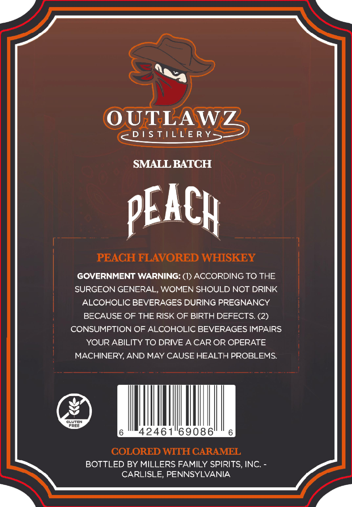

# TTB COLA Label Images - TTBID 26066001000050

**Brand Name:** OUTLAWZ DISTILLERY

**Issue Date:** 03/09/2026

**Origin Code:** 39

**Product Class/Type:** 149

**Source:** [TTB Public COLA Registry](https://ttbonline.gov/colasonline/viewColaDetails.do?action=publicFormDisplay&ttbid=26066001000050)

## Label Images

### Back Label

## Extracted Label Text

*Text extracted via OCR - may contain errors*

### Back Label

OUTLAWZ
D / S TILLE R Y
SMALL BATCH
PEACH
PEACH FLAVORED WHISKEY
GOVERNMENT WARNING: (1) ACCORDING TO THE
SURGEON GENERAL, WOMEN SHOULD NOT DRINK
ALCOHOLIC BEVERAGES DURING PREGNANCY
BECAUSE OF THE RISK OF BIRTH DEFECTS; (2)
CONSUMPTION OF ALCOHOLIC BEVERAGES IMPAIRS
YOUR ABILITY TO DRIVE ACAR OR OPERATE
MACHINERY,AND MAY CAUSE HEALTH PROBLEMS
CLUTEN
FrEE
42461"69086'
COLORED WITH CARAMEL
BOTTLED BY MILLERS FAMILY SPIRITS, INC:
CARLISLE, PENNSYLVANIA
