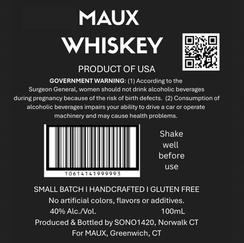

# TTB COLA Label Images - TTBID 26067001000112

**Brand Name:** MAUX

**Issue Date:** 03/24/2026

**Origin Code:** 14

**Product Class/Type:** 140

**Source:** [TTB Public COLA Registry](https://ttbonline.gov/colasonline/viewColaDetails.do?action=publicFormDisplay&ttbid=26067001000112)

## Label Images

### Label 1

## Extracted Label Text

*Text extracted via OCR - may contain errors*

**Detected Proof:** 80

### Label 1

MAUX
WHISKEY
PRODUCT OF USA
GOVERNMENT WARNING: (1) According to the
Surgeon General, women should not drink alcoholic beverages
during pregnancy because of the risk of birth defects_
(2) Consumption of
alcoholic beverages impairs your ability to drive
car Or operate
machinery and may cause health problems_
Shake
well
before
use
Dobi
SMALL BATCHI HANDCRAFTED I GLUTEN FREE
No artificial colors, flavors or additives
40% Alc /Vol:
10OmL
Produced & Bottled by SONO1420, Norwalk CT
For MAUX, Greenwich
CT
