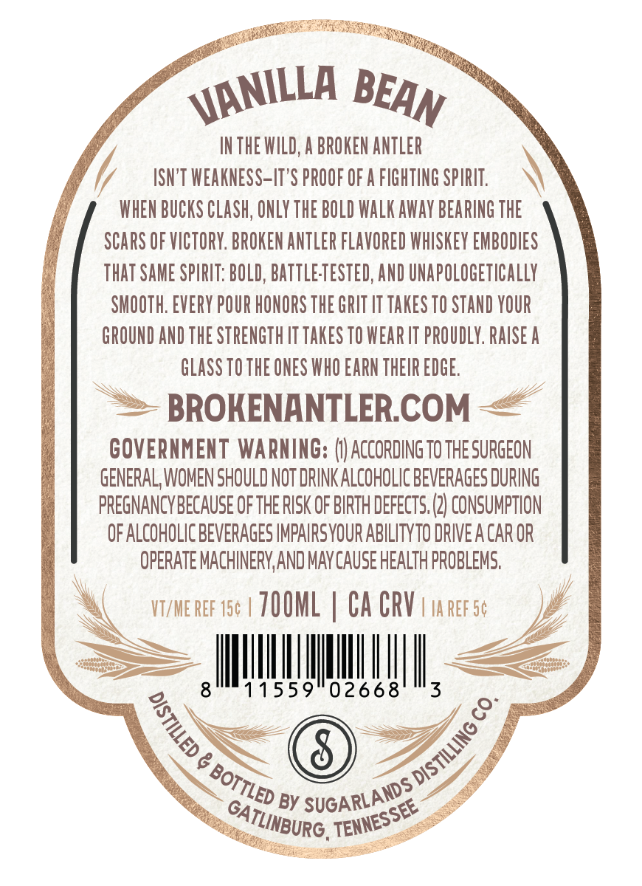
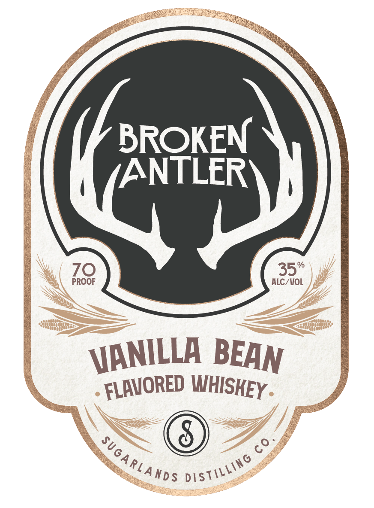

# TTB COLA Label Images - TTBID 26068001000086

**Brand Name:** BROKEN ANTLER

**Issue Date:** 03/09/2026

**Origin Code:** 43

**Product Class/Type:** 149

**Source:** [TTB Public COLA Registry](https://ttbonline.gov/colasonline/viewColaDetails.do?action=publicFormDisplay&ttbid=26068001000086)

## Label Images

### Back Label

### Front Label

## Extracted Label Text

*Text extracted via OCR - may contain errors*

**Detected Proof:** 70

### Back Label

IN THE WILD, A BROKEN ANTLER
ISN'T WEAKNESS-IT'S PROOF OF A FIGHTING SPIRIT .
WHEN BUCKS CLASh; ONLY THE BOLD WaLK AWay BEARING THE
SCARS OF VICTORY. BROKEN ANTLER FLAVORED WHISKEY EMBODIES
that SAME SPIRIT: BOLD, BaTtLeTESTED; AND UNapolOGetiCallY
SMOOTH. EVERY POUR HONORS THE GRIT LT TAKES TO STAND YOUR
GROUND AND THE STRENGTH IT TAKES TO WEAR IT PROuDLY. RAISE a
GLaSS TO THE ONES WHO EARN THEIR EDGE.
BROKENANTLERCOM
GOVERNMENT WARNING:
ACCORDing TO THE SURGEON
GENERAL, WOMEN SHOULD NOT DRINK ALCOHOLIC BEVERAGES DURING
PREGNANCYBECAUSE OFTHE RISK OF BIRTH DEFECTS, (2} CONSUMPTION
OF ALCOHOLIC BEVERAGES IMPAIRSYOUR ABILITYTO DRIVE A CAR OR
OPERATE MACHINERY AND MAY CAUSE HEALTH PROBLEMS:
VT/ME REF 154 | ZOOML
Ca CRV
IA REF 54
8
11559
02668
3
8
8
GAI
BY
VANILLA
BEAN
1
DISTILLING €
BOTTLED '
SUGARLANDS
TENNESSEE
TLINBURG

### Front Label

BROKEN
IANTLER
%
70
35
PROOF
ALC/VOL
60
VANILLA
BEAN
FLAVORED
WHISKEY
SUGARLANDS
Distilling
