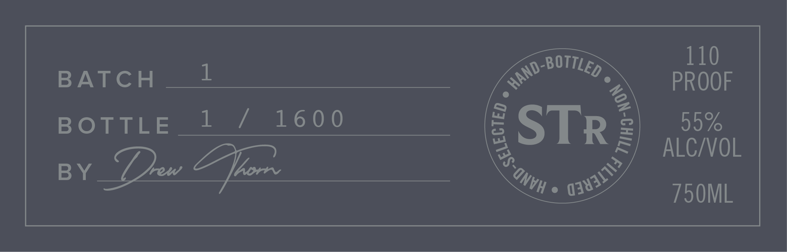

# TTB COLA Label Images - TTBID 26068001000089

**Brand Name:** SILVERTHORN RESERVE

**Fanciful Name:** BLENDER'S ART THE RYE BLEND

**Issue Date:** 03/09/2026

**Origin Code:** 25

**Product Class/Type:** 102

**Source:** [TTB Public COLA Registry](https://ttbonline.gov/colasonline/viewColaDetails.do?action=publicFormDisplay&ttbid=26068001000089)

## Label Images

### Back Label

### Label 4

## Extracted Label Text

*Text extracted via OCR - may contain errors*

*1 image(s) excluded: text did not meet readability threshold*

**Detected Proof:** 110

### Back Label

110
BATch
1
PROOF
BOTTLE
1 /
16 0 0
STR
2
55%
ALCZVOL
BY
[en
hrn
750ML
BOTTLED
HAND-
(
0343111J
