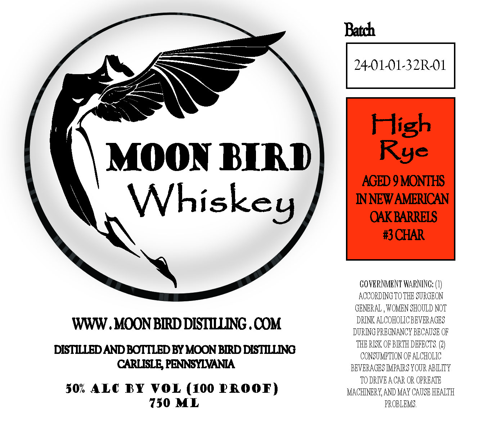

# TTB COLA Label Images - TTBID 26068001000243

**Brand Name:** MOON BIRD WHISKEY

**Fanciful Name:** HIGH RYE AGED 9 MONTHS IN NEW AMERICAN OAK BARRELS #3 CHAR

**Issue Date:** 03/10/2026

**Origin Code:** 39

**Product Class/Type:** 140

**Source:** [TTB Public COLA Registry](https://ttbonline.gov/colasonline/viewColaDetails.do?action=publicFormDisplay&ttbid=26068001000243)

## Label Images

### Label 1

## Extracted Label Text

*Text extracted via OCR - may contain errors*

### Label 1

MOON BIRD

Whiskey

GOVERNMENT WARNING: (1)

ACCORDINGTO THE SURGEON

GENERAL , WOMEN SHOULD NOT

www DRINK ALCOHOLICBEVERAGES

- MOON BIRD DISTILLING .COM DURING PREGNANCY BECAUSE OF

DISTILLED AND BOTTLED BY MOON BIRD DISTILLING remnant
CARLISLE, PENNSYLVANIA BEVERAGES IMPAIRS YOUR ABILITY

, TODRIVEACAR OR OPRBATE

7350 ML PROBLEMS
