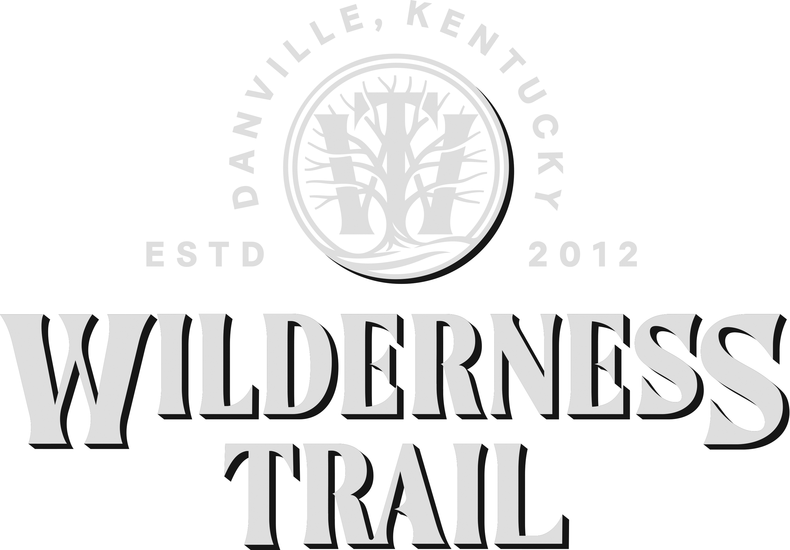
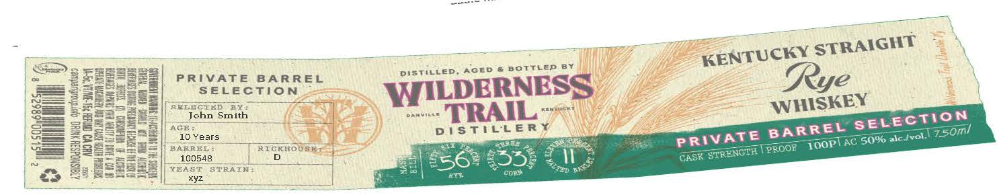
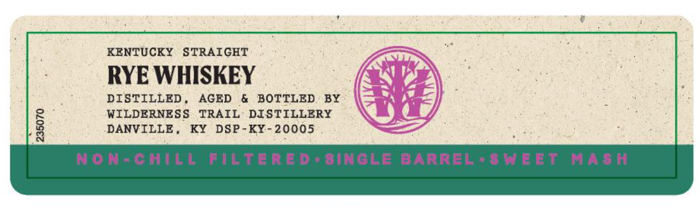
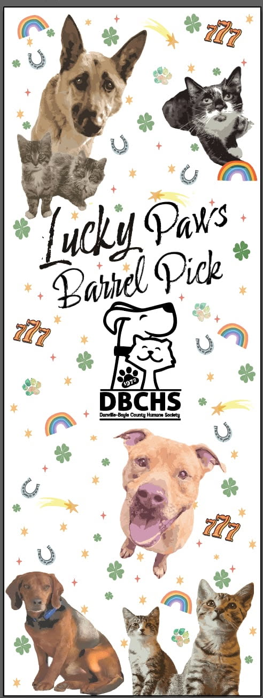

# TTB COLA Label Images - TTBID 26068001000327

**Brand Name:** WILDERNESS TRAIL

**Issue Date:** 03/10/2026

**Origin Code:** 22

**Product Class/Type:** 102

**Source:** [TTB Public COLA Registry](https://ttbonline.gov/colasonline/viewColaDetails.do?action=publicFormDisplay&ttbid=26068001000327)

## Label Images

### Label 1

### Label 2

### Label 3

### Label 4

## Extracted Label Text

*Text extracted via OCR - may contain errors*

*1 image(s) excluded: text did not meet readability threshold*

**Detected Age:** 10 Years

### Label 2

STRAIGHT
AGE0
bottled
PRIVATE
BA RREL
Pistilled;
Rye
SELEction
WIDERNESS
RE John
Smith
VILL
TRAIL
WHISKEY
ACE
D !S TiLLERY
750ml
10 Years
AC
;50%6
BA B R
RICKEOUSE
PROOR   IOOP]E
1
100548
55
CASK
KEAS
STRAIN ;
CORy
XYZ
KENTUCKY
SELEcTon
BARREL
PRIVATE
Fale Ivol
STRENGTH
564
YLItp
au

### Label 3

KENTUCKY
STRAIGHT
RYE WHISKEY
DISTILLED
AGED
6
BOTTLED
BY
WILDERNESS
TRAIL
DISTILLERY
8
DANVILLE
KY
DSP-KY
20005
NON-GHILg
FILTeRE D aBINGLE BARREL ' $ HEIE TNaS H

### Label 4

uck Paws
Pirk
722
DBCHS
Danwlla-Boula County Huene Socbru
8
ZZz
Bael
