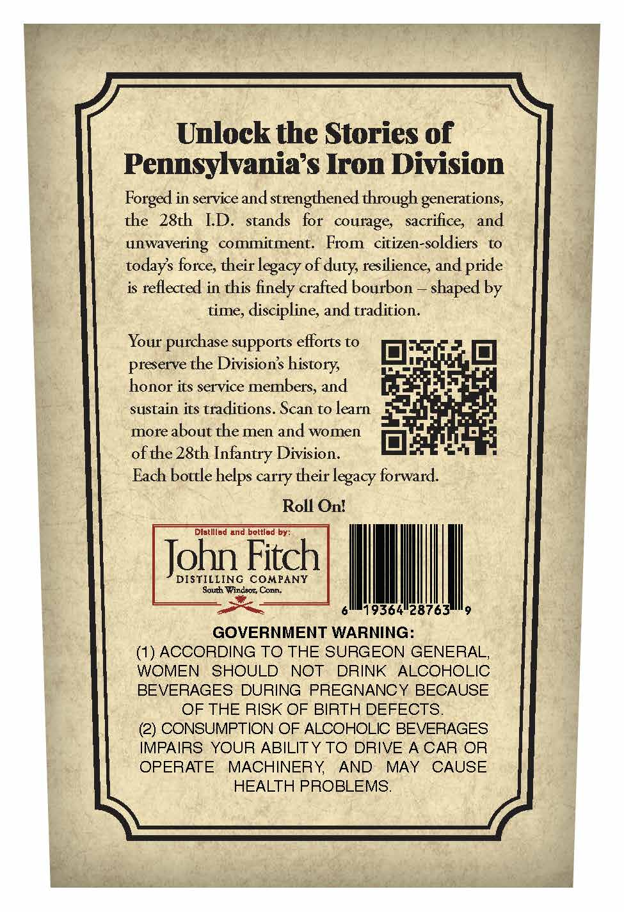
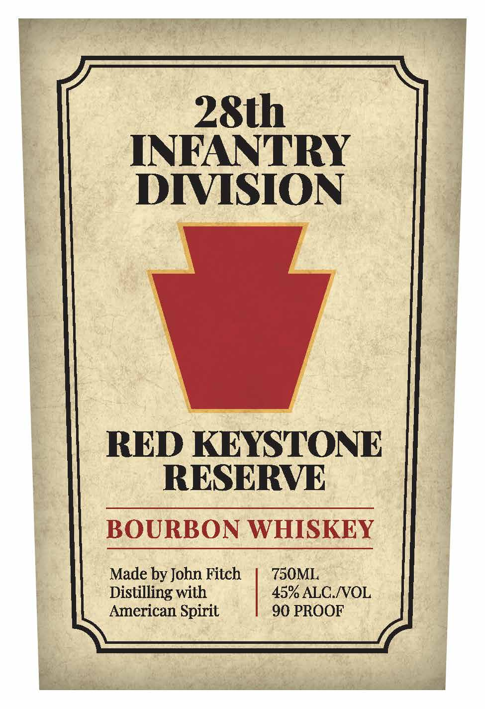

# TTB COLA Label Images - TTBID 26068001000437

**Brand Name:** 28TH INFANTRY DIVISION

**Fanciful Name:** RED KEYSTONE RESERVE

**Issue Date:** 03/10/2026

**Origin Code:** 39

**Product Class/Type:** 141

**Source:** [TTB Public COLA Registry](https://ttbonline.gov/colasonline/viewColaDetails.do?action=publicFormDisplay&ttbid=26068001000437)

## Label Images

### Back Label

### Front Label

## Extracted Label Text

*Text extracted via OCR - may contain errors*

**Detected Proof:** 90

### Back Label

Unlock the Stories of
Pennsylvanias Iron Division
Forged in service and
strengthened through generations,
the  28th
ID:  stands
courage,   sacrifice,  and
unwavering   commitment:
From  citizen-soldiers
to
todays force, their
of
resilience; and
is reflected in this finely crafted bourbon
shaped by
time, discipline; and tradition.
Your purchase supports efforts to
preserve the Divisions_
honor its service members, and
sustain its traditions. Scan to
more about the men and women
ofte 28th Infantry Division.
Each bottle helps carry their legacy forward.
Roll Onl
Distillod and bottlod by =
John Fitch
DISTILLING COMPANY
Sounth Wlndecr; Conn,
19364*28763
GOVERNMENT WARNING:
(1) ACCORDING TO THE SURGEON GENERAL,
WOMEN
SHOULD
NOT
DRINK
ALCOHOLIC
BEVERAGES DURING PREGNANCY BECAUSE
OF THE RISK OF BIRTH DEFECTS.
(2) CONSUMPTION OF ALCOHOLIC BEVERAGES
IMPAIRS YOUR ABILIT Y TO DRIVE A CAR OR
OPERATE
MACHINERY
AND
MAY
CAUSE
HEALTH PROBLEMS.
for
legacy-
dutys
pride
history
Jearn

### Front Label

28th
INFANTRY
DIVISION
RED KEYSTONE
RESERVE
BOURBON WHISKEY
Made by John Fitch
750ML
Distilling with
45 ALC.NOL
American Spirit
90 PROOF
