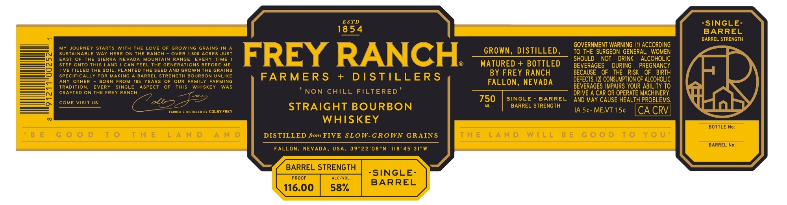

# TTB COLA Label Images - TTBID 26068001000676

**Brand Name:** FREY RANCH FARMERS + DISTILLERS

**Issue Date:** 03/10/2026

**Origin Code:** 32

**Product Class/Type:** 101

**Source:** [TTB Public COLA Registry](https://ttbonline.gov/colasonline/viewColaDetails.do?action=publicFormDisplay&ttbid=26068001000676)

## Label Images

### Label 1

## Extracted Label Text

*Text extracted via OCR - may contain errors*

**Detected Proof:** 116

### Label 1

ESTD
SINGLE-
18 5 4
BARREL
BARREL STRENGTH
My JOURNEY
STARTS
With THE Love
GROWING
GRAINS IN
GOVERNMENT WARNING:
ACCORDING
SUSTAINABLE WAY HERE ON THE RANCH
OVER
500 ACRES JUST
FREY RANCH
GROWN, DISTILLED ,
To THE SURGEON GENERAL
WOMEN
EAST
THE
SIERRA
NEVADA
MOUNTAIN RANGE
EVERY
TIME
SHOULD
NOT
DRINK
ALCOHOLIC
STEP ONTO This LAND
CAN FEEL THE GENERATIONS BEFORE ME
MATURED + BOTTLED
BEVERAGES
DURING
PREGNANCY
TveTilled THE Soil
PLANTED THE SEED AND GROWN THE GRAINS
BY FREY RANCH
BECAUSE
OF
THE   RISK
OF   BIRTH
SPECIFICALLY FOR Making
BARREL STRENGTA BOURBON UNLIKE
FARMER S
+
DSTILLERS
DEFECTS: (2| CONSUMPTION OF ALCOHOLIC
ANY
OTHER
BORN FROM
165
YEARS
OUR
FAMILY
FARMING
FALLON, NEVADA
TRADITION
EVERY
SINGLE
ASPECT
ThIS
WAISKEY
WAS
BEVERAGES IMPAIRS YOUR ABILITY TO
CRAFTED ON THE FREY RANCH:
NON CHILL FILTERED
DRIVE A CAR OR OPERATE MACHINERY,
COME VisiT US
750
SINGLE
BARREL
AND MAY CAUSE HEALTH PROBLEMS
FARMED
distilLeo
cOLBY FREY
STRAIGHT BOURBON
BARREL STRENGTH
IA 5c-ME,VT 15c
CA CRVL
WHISKEY
BOTTLE No:
T 0
T H E
L A N D
A N D
DISTILLED from FIVE SLOW-GROWN GRAINS
T H E
L A N D
W | L L
B E
G 0
T 0
Y 0 U
BARREL No:
FALL
NEVADA,
39*22'08"N
118 " 45'31"W
BARREL STRENGTH
"SINGLE-
PROOF
ALC/VOL:
BARREL
116.00
58%
ON,
USA,
