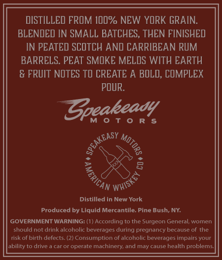

# TTB COLA Label Images - TTBID 26068001000685

**Brand Name:** SPEAKEASY MOTORS AMERICAN WHISKEY COMPANY

**Fanciful Name:** 1934 BLEND

**Issue Date:** 03/10/2026

**Origin Code:** 02

**Product Class/Type:** 109

**Source:** [TTB Public COLA Registry](https://ttbonline.gov/colasonline/viewColaDetails.do?action=publicFormDisplay&ttbid=26068001000685)

## Label Images

### Back Label

## Extracted Label Text

*Text extracted via OCR - may contain errors*

### Back Label

DISTILLED FROM IdO% NEW YORK GRAIN.
BLENDED IN SMALL BATCHES, THEN FINISHED]
IN PEATED SCOTCH AND CARRIBEAN RUM
BARRELS. PEAT SMOKE MELOS WITH EARTH
& FRUIT NOTES TD CREATE A BOLD; COMPLEX
POUR:
Zpeakeady
Distilled In New York
Produced by Liquld Mercantile. Pine Bush; NY
GOVERNMENT WARNING: (1 } According to the Surgeon General; women
should not drink alcoholic beverages during pregnancy because of the
risk oft birth defects. (2) Consumption of alcoholic beverages impairs your
ability to drive
caror operate
machinery; and may cause health problems.
SPGAKEASY
9
(
'WHISKEY `
