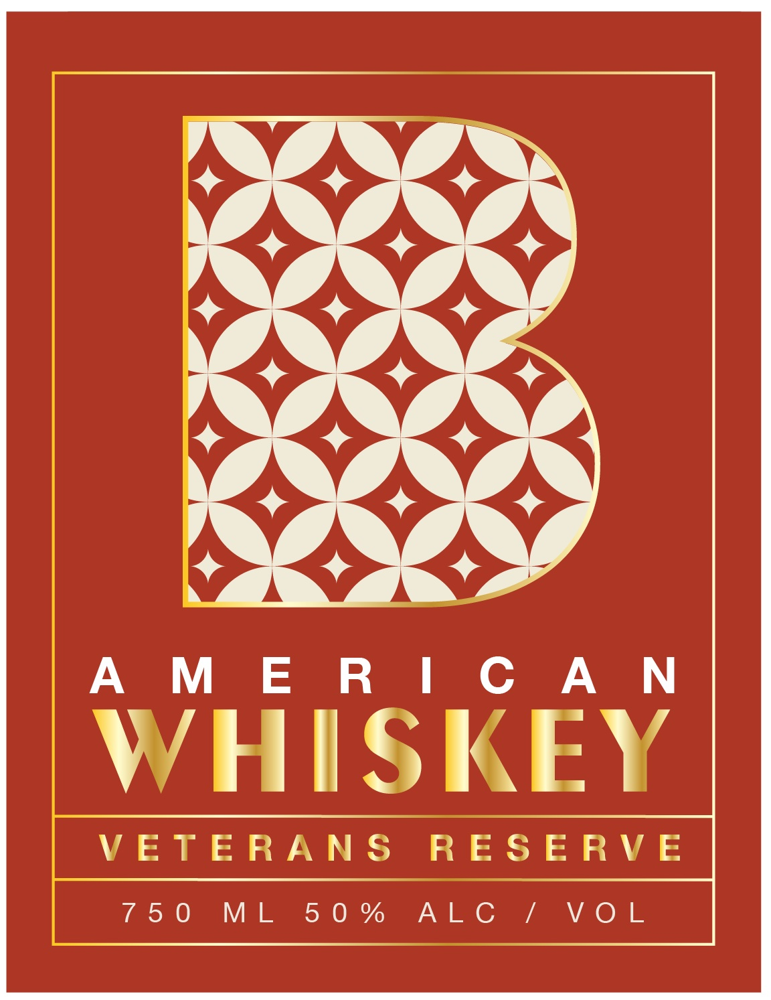
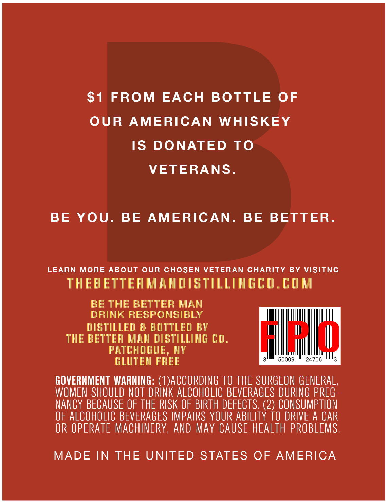
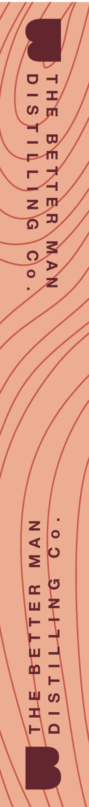

# TTB COLA Label Images - TTBID 26068001000713

**Brand Name:** THE BETTER MAN DISTILLING CO.

**Fanciful Name:** AMERICAN WHISKEY VETERANS RESERVE

**Issue Date:** 03/10/2026

**Origin Code:** 02

**Product Class/Type:** 140

**Source:** [TTB Public COLA Registry](https://ttbonline.gov/colasonline/viewColaDetails.do?action=publicFormDisplay&ttbid=26068001000713)

## Label Images

### Label 1

### Label 2

### Label 3

## Extracted Label Text

*Text extracted via OCR - may contain errors*

*2 image(s) excluded: text did not meet readability threshold*

### Label 2

$1 FROM EACH BOTTLE OF

OUR AMERICAN WHISKEY

IS DONATED TO

VETERANS

BE YOU. BE AMERICAN. BE BETTER

LEARN MORE ABOUT OUR CHOSEN VETERAN CHARITY BY VISITNG

THEBETTERMANDISTILLINGCO.COM

BE THE BETTER MAN

DRINK RESPONSIBLY

i

qi

LU!

DISTILLED & BOTTLED BY

ll

il

THE BETTER MAN DISTILLING CO

|

PATCHOGUE, NY

al

|

Ml

|

Ha

GLUTEN FREE

GOVERNMENT WARNING: (1)ACCORDING TO THE SURGEON GENERAL

WOMEN SHOULD NOT DRINK ALCOHOLIC BEVERAGES DURING PREG

NANCY BECAUSE OF THE RISK OF BIRTH DEFECTS. (2) CONSUMPTION

OF ALCOHOLIC BEVERAGES IMPAIRS YOUR ABILITY TO DRIVE A CAR

OR OPERATE MACHINERY, AND MAY CAUSE HEALTH PROBLEMS

MADE IN THE UNITED STATES OF AMERICA
