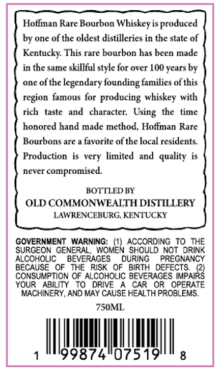
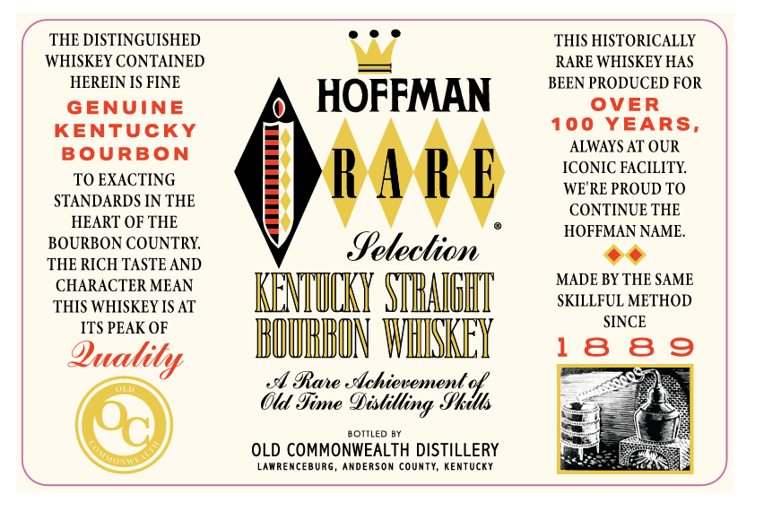
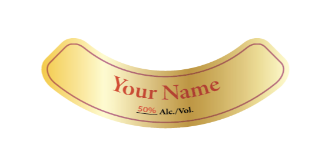

# TTB COLA Label Images - TTBID 26068001000715

**Brand Name:** HOFFMAN RARE

**Issue Date:** 04/02/2026

**Origin Code:** 22

**Product Class/Type:** 101

**Source:** [TTB Public COLA Registry](https://ttbonline.gov/colasonline/viewColaDetails.do?action=publicFormDisplay&ttbid=26068001000715)

## Label Images

### Back Label

### Front Label

### Label 3

## Extracted Label Text

*Text extracted via OCR - may contain errors*

*1 image(s) excluded: text did not meet readability threshold*

### Back Label

Hoffman Rare Bourbon
Whiskeyis produced
by one of the oldest distilleries in the state of
Kentucky: This rare bourbon has been made
in the same skillful style for over 100 years by
one ofthe
legendary founding families of this
region famous for producing whiskey with
rich
taste   and
character:
the   timc
honored hand made method, Hoffman Rare
Bourbons are a favorite of the local residents:
Production
very limited and  quality
never
compromised
BOTTLED BY
OLD COMMONWEALTH DISTILLERY
LAWRENCEBURG, KENTUCKY
GOVERNMENT WARNING:
ACCORDING To THE
SURGEON GENERAL
INOMEN SCCORD NGOTORIHE
ALCOHOLIC
BEVERAGES
DURING
PREGNANCY
BECAUSE
OF   THE RiSK
OF
BIRTH   DEFECTS
CONSUMPTION OF ALCOHOLIC BEVERAGES
CTPARK}
YOUR
ABILITY
To
DRIVE
CAR
OR
OPERATE
MACHINERY, AND MAY CAUSE HEALTH PROBLEMS,
750ML
99874"075191
Using

### Front Label

THE DISTINGUISHED
THIS HISTORICALLY
WHISKEY CONTAINED
RARE WHISKEY HAS
HEREIN IS FINE
BEEN PRODUCED FOR
GENUINE
HOFFMAN
OVER
KENTUCKY
100 YEARS,
BoURBON
ALWAYS AT OUR
TO EXACTING
RAk E
ICONIC FACILITY
WE RE PROUD TO
STANDARDS IN THE
CONTINUE THE
HEART OF THE
HOFFMAN NAME_
BOURBON COUNTRK
Setection
THE RICH TASTE AND
CHARACTER MEAN
MADE BY THE SAME
THIS WHISKEY IS AT
KENIULKY SAIEM
SKILLFUL METHOD
ITS PEAK OF
SINCE
Quatity
BMURHON WIKEY
1
8
8
9
IRane .chievement
Old' %e
"3pkdus
BOTLED BY
OLD COMMONWEALTH DISTILLERY
LAWRENcEBURG _
AndeRSON county, KenTUcKY
9bislilling =
