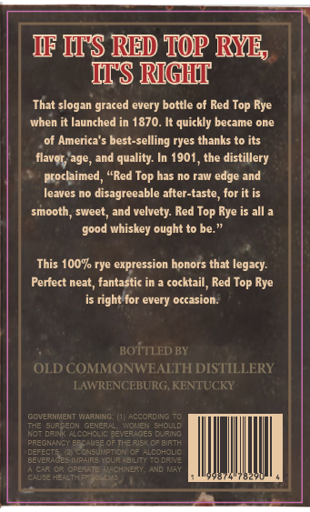
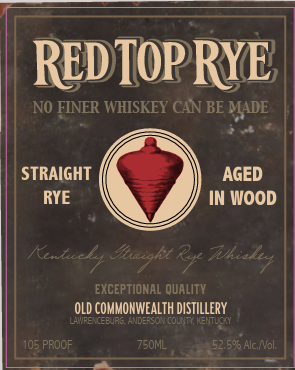
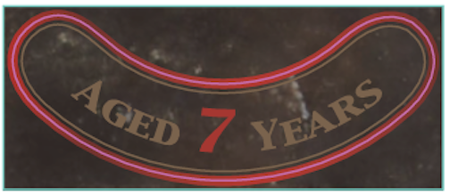

# TTB COLA Label Images - TTBID 26068001000719

**Brand Name:** RED TOP RYE

**Issue Date:** 03/18/2026

**Origin Code:** 22

**Product Class/Type:** 102

**Source:** [TTB Public COLA Registry](https://ttbonline.gov/colasonline/viewColaDetails.do?action=publicFormDisplay&ttbid=26068001000719)

## Label Images

### Back Label

### Front Label

### Label 2

## Extracted Label Text

*Text extracted via OCR - may contain errors*

*1 image(s) excluded: text did not meet readability threshold*

**Detected Proof:** 105

### Back Label

WF HTS REEDD TOP RYE
IIIS RIIGHDI
That slogan graced every bottle of Red Top Rye
when it launched in 1870. It quickly became one
of America'$ best-selling ryes thanks to its
age, and quality: In 1901
the
distillery
proclaimed
"Red Top has no raw edge and
leaves no disagreeable alter-taste , for it is
smooth, sweet , and velvety: Red Top Rye is all a
whiskey ought to be:
This 10% rye expression honors that legacy:
Perfect neat , fantastic in
cocktail, Red Top Rye
is right for every occasion:
BOTTLED BY
OLD COMMONWEALTH DISTILLERY
LAWRENCEBURG, KENTUCKY
GCVERNMENT Warnimg
ACCORDINC
THE surgeon
GENERAL
Wol 31
BhoULD
dziny
A
zeverAGES
CUIRING
PREGNANCY BECAUSE OFTLERIsK C=
DefeCT
CNSUNATAN
icohalic
BEVERRGES ImpriR?
[cuR AbILTTT0 DRTVE
OPERATE
AchinerY, AND RAY
Cas =
Hlavol
good

### Front Label

REDTOPRYE |
NO FINER WHISKEY CAN BE MADE
STRAIGHT
AGED
RYE
IN WOOD
Kexkaly Ihaight &y Thkialcy
EXCEPTIONAL quaLITT
OLD COMMONWEALTh dIstIllery
WRE
Auderso
INMMN
105 PROOF
750NL
52.596 Alc Nol:
